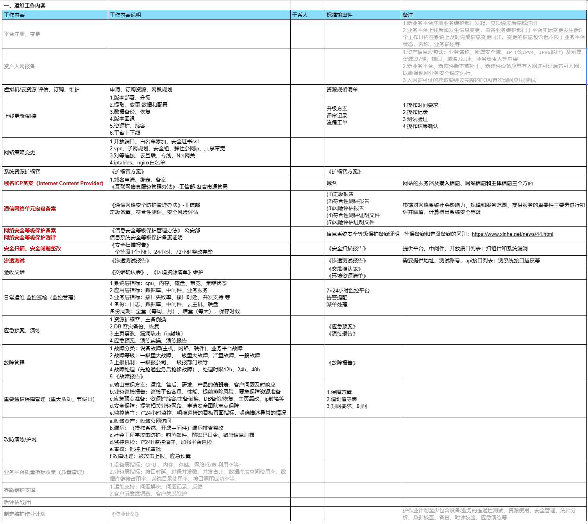

运维

## 参考资料
- [运维技能图谱](https://luanpeng.blog.csdn.net/article/details/78744665)
- [云原生/微服务架构/运维 系列课程](https://blog.csdn.net/luanpeng825485697/category_11735474.html)
- [鸟哥私房菜-基础学习篇]
- [鸟哥私房菜-服务器架设篇]
- [linux就该这么学]
- [kubernetes权威指南]
- [Kubernetes 中文指南/云原生应用架构实战手册]
- [prometheus-book](https://yunlzheng.gitbook.io/prometheus-book/)
- [SRE Google运维解密]
    - Site Reliability Engineering: How Google Runs Production Systems(网站可靠性工程：谷歌如何运行生产系统)
- [蓝绿发布、滚动发布、灰度发布/金丝雀发布、AB Test 对比](https://zhuanlan.zhihu.com/p/147567222)
- [一个运维老将的自我修养](https://zhuanlan.zhihu.com/p/459028089)
- 运维分类：
    - 业务/平台运维：主要是面向业务平台SaaS的；
    - 系统运维：比如负责硬件设备、主机资源、网络，操作系统的、底层IaaS的等等；
    - IT运维：负责企业网络、设备、机房
    - 安全运维：负责信息安全的；
    - 数据库DBA：是专门负责数据库；
    - 运维开发：Devops（AIOps）负责开发运维工具和平台；
- 名词解释：
    - IDC： internet data center 互联网数据中心，简称IDC机房
    - 云、CDN、IDC 三个概念	https://www.zhihu.com/question/40534161

## 一、规范运维工作流程
### 1.1 运维工作内容:


### 1.2 制定维护作业计划:


### 1.3 信息安全梳理:


### 1.4 信息安全-敏感数据分级分类表:


## 二、运维技术栈
### 2.0 虚拟化
- Xen：半虚拟化技术，它并不是个真正的虚拟机，而是相当于自己运行了个内核的实例
- kvm、vmware：完全虚拟的
- OpenStack：是云管理平台，其本身并不提供虚拟化功能，真正的虚拟化能力是由底层的Hypervisor（如KVM、Qemu、Xen等）提供。而OpenStack则可以管理KVM虚拟化环境
- docker，k8s：

### 2.1 Linux[服务器基础](../cs_base/2021-01-02-linux-base.md)
- 用户、权限：sudo、chown、chmod、useradd、ssh...
- 文件管理：ll -lh、mkdir、cp、scp、mv、vi、cat、
- CPU：lscpu、top、
- 内存：扩缩容、free -m、
- 磁盘：挂载解挂mount、lsblk、df -h、du -hd1
- 网络：端口、协议ifconfig、ping、netstat、telnet、traceroute、ipaddr、network service、ip route
- 日志：tail
- iptables：[白名单配置](https://www.ngui.cc/el/3319772.html?action=onClick)
- 防火墙firewalld：封堵ip
  - 开启firewalld：systemctl start firewalld
  - ip封堵：firewall-cmd --permanent --add-rich-rule='rule family="ipv4" source address="192.168.145.1" port protocol="tcp" port="8080" reject'
  - ip解封：firewall-cmd --permanent --add-source=192.168.145.1
- 抓包：tcpdump、wireshark：https://luanpeng.blog.csdn.net/article/details/82991778
- ssl/https证书: 
  - [SSL中，公钥、私钥、证书(pem、crt、cer、key、csr)](https://blog.csdn.net/HD243608836/article/details/127441701)
- jumpServer...

### 2.2 shell[编程](../dev_ops/2021-03-01-shell.md)
- 变量:$
- 传递参数:$n
- 数组
- 运算符
- echo命令
- printf命令
- test 命令
- 流程控制【if for while】
- 函数
- 输入/输出重定向【<、>】
- 文件包含

### 2.3 DBA
- sql脚本
- sql优化
- 数据库优化
- 数据库原理
- 灾备、恢复
    - 【容灾备份】【数据库】[mysql数据库备份恢复方案](../cs_base/2021-01-05-database.md)
    - 【容灾备份】【数据库】[PostGresql数据库备份恢复方案](../cs_base/2021-01-05-database.md)
- 读写分离
- 主备、主从复制
- 数据库监控

### 2.4 数据库/存储中间件
- MySql
    - 【数据库部署】[MySql单机部署](../dev_ops/2021-03-11-mysql-2.md)
    - 【数据库部署】[MySql主从&一主多从集群部署](../dev_ops/2021-03-11-mysql-3.md)
- Mycat
    - 【中间件部署】[Mycat部署](../distributed/2021-06-24-mycat.md)
- Postgresql
    - 【数据库部署】PostgreSQL单机部署
- PGPool
    - 【数据库部署】PostgreSQL集群+PGPool集群部署
- Redis
    - 【数据库部署】[Redis单机部署](../dev_ops/2021-03-12-redis.md)
    - 【数据库部署】[Redis-cluster 5.x集群部署](../dev_ops/2021-03-12-redis-3.md)
    - 【数据库部署】[Redis哨兵模式](../dev_ops/2021-03-12-redis-2.md)
- MQ
    - 【组件部署】[Kafka单机部署](../dev_ops/2021-03-17-kafka.md)
    - 【组件部署】[Kafka + zookeeper集群部署](../dev_ops/2021-03-17-kafka2.md)
    - 【组件部署】RabbitMQ集群部署
    - 【组件部署】RocketMQ双主双从集群部署
- ES
    - 【数据库部署】[ES单机部署](../dev_ops/2021-03-18-es.md)
    - 【数据库部署】[ES集群鉴权部署](../dev_ops/2021-03-18-es.md)
- Mongodb
    - 【数据库部署】[MongoDB单机部署](../dev_ops/2021-03-16-mongodb.md)
    - 【数据库部署】[MongoDB 3.4 分片副本集集群部署](../dev_ops/2021-03-16-mongodb.md)
- FastDFS
    - 【存储部署】[FastDFS + Nginx及鉴权部署](../dev_ops/2021-03-14-fastdfs.md)
- Minio
    - 【存储部署】[Minio集群部署](../dev_ops/2021-03-14-minio.md)
- SeaweedFS
    - 【存储部署】[SeaweedFS部署](../dev_ops/2021-03-14-seaweedfs.md)
- Ftp
    - 【存储部署】Ftp部署
- Zeekeeper
    - 【组件部署】[Zeekeeper部署](../dev_ops/2021-03-20-zookeeper.md)
- clickhouse
    - 【数据库部署】[clickhouse部署](../dev_ops/2021-03-21-clickhouse.md)
- maxwell
    - 【数据库部署】[maxwell部署](../dev_ops/2021-03-22-maxwell.md)
- influxdb
    - 【数据库部署】[influxdb部署](../dev_ops/2021-03-23-influxdb.md)

### 2.5 服务器中间件
- JDK
    - 【组件部署】[jdk安装](../dev_ops/2021-03-01-jdk.md)
- Nginx
    - 【组件部署】[nginx安装](../dev_ops/2021-03-13-nginx.md)
- Tomcat
    - 【组件部署】[tomcat安装](../dev_ops/2021-03-13-tomcat.md)
- keepalived
    - 【中间件部署】[Keepalived安装](../dev_ops/2021-03-15-keepalived.md)
    - 【组件部署】keepalived + haproxy部署
- HAProxy
    - 【中间件部署】HAProxy

### 2.6 高可用部署架构
- 【LVS + keepalived + Nginx】 实现负载均衡、高可用集群
- 【LVS + HAProxy】 提供高可用性、负载均衡以及基于TCP(第四层)和HTTP(第七层)应用的代理

#### 2.6.1 高可用相关理论
SLA（Service Level Agreement）服务等级协议  
SLA = MTBF / (MTBF + MTTReco)

|   可用性   |   年故障时间   | 季故障时间 | 月故障时间 |
|:-------:|:---------:|:-----:|:-----:|
| 99.999% | 5.26 min  |       |       |
| 99.995% | 26.28 min |       |       |
| 99.99%  | 52.6 min  |       |       |
| 99.95%  | 4.38 hour |       |       |
|  99.9%  | 8.76 hour |       |       |
|  99.5%  | 43.8 hour |       |       |
|   99%   | 87.6 hour |       |       | 

- MTTReco（Mean time to recovery）平均恢复时间
  该指标是从系统故障中恢复所需的平均时间，这包括从系统出现故障到再次完全正常运行。该指标可用于衡量运维团队的稳定性。
  MTTReco = 需要计算时间段的总停机时间 / 故障次数  
  假设我们的系统在 24 小时内发生了两起单独的故障，停机了 30 分钟。30 除以 2 等于 15，因此我们的 MTTReco 为 15 分钟。

- MTBF（Mean time between failures）平均故障间隔时间  
  该指标用于跟踪产品的可用性和可靠性，指标时间数值越大，系统越可靠。MTBF 是衡量可修复系统中故障的指标。
  MTBF = 需要计算时间段的总运行时间 / 故障次数  
  假设评估 24 小时时间段，并且在此时间段中有两个小时的停机时间。我们的总正常运行时间为22小时，除以2，得出 MTBF 为 11 小时。

- MTTA（Mean time to acknowledge）平均确认时间
  该指标是从触发警报到开始处理问题所需的平均时间。此指标可用于跟踪团队的响应能力和警报系统的有效性。
  MTTA = 警报和确认之间的总时间 / 故障次数  
  假设一个月内有 10 次故障，从告警发出到运维确认并开始处理之间总共花费了 40 分钟，那么将 40 除以 10 得出月度的 MTTA 为 4 分钟。

- MTTRepa（Mean time to repair）平均修复时间
- MTTResp（Mean time to respond）平均响应时间
  该指标是从第一次收到故障警报时起，到系统恢复所需的平均时间。  
  MTTResp = 警报开始到系统再次完全正常运行的完整响应总时间 / 故障次数

- MTTReso（Mean time to resolve）平均解决时间
  该指标是完全解决故障所需的平均时间。这不仅包括检测故障、诊断问题和修复问题所花费的时间，还包括出具故障报告，以及确保故障不再发生所花费的时间。
  MTTReso = （故障发生到确保故障不再发生花费时间之和 - 系统可用之后非工作时间之和） / 故障次数
  假设系统在一次故障中总共宕机了 2 个小时，而团队又在第二天上班后花费 2 个小时来修复以确保系统不会再次发生故障，那么 MTTR 为 4 小时。

### 2.7 监控告警
告警系统建设的重要原则：规则随生产故障补充迭代

- 指标监控: 【Prometheus + Grafana】搭建监控平台
    - 01 基础设施指标：物理环境下为服务器、存储、网络设备等 基础硬件设施健康状态指标 云环境下为各类云服务的状态指标
    - 02 操作系统指标：CPU、内存、磁盘 文件系统及其他标识操作系 统运行状态的指标
    - 03 业务进程指标：进程存活、进程CPU占用、进程内存占用、 进程文件打开数等标识进程运行状态的指 标
    - 04 应用程序指标：业务服务JVM堆内存、 Kafka堆积数、Mysql连接数、 Elasticsearch集群状态等应用级指标
    - 05 对外服务指标：网站响应时间、接口调用状态码、接口调并发支撑 用成功率等直接影响用户体验的指标

- 日志收集/监控：【ELK】、【EFK（Fluent-bit/Fluentd）】、【Loki + Grafana】搭建日志平台
    - 操作系统日志：用于安全审计、数据恢复等 系统运行日志：用于系统异常行为排查
    - 中间件日志：负载均衡、数据库、消息队列等中间件日志：用于性能瓶颈分析、故障定位
    - 业务服务日志：用于用户行为分析、程序 bug定位、故障分析
  
- Thanos是一个开源、高可用、具有长期存储能力的 分布式Prometheus监控方案

### 2.8 [网络](../cs_base/2021-01-04-net.md)
[网络不通？服务丢包？ TCP 连接状态详解及故障排查](https://mp.weixin.qq.com/s?__biz=MzA4Nzg5Nzc5OA==&mid=2651719369&idx=1&sn=5d628d468ca444266226fba5e93cf6cc&chksm=8bc8c560bcbf4c76d450b04f16709434d70aad4b2d59684abbf8b7e5db74d9106c3b9689694a&scene=27)

- 抓包工具：tcpdump、wireshark：
  - [linux-网络数据包抓取-tcpdump](https://luanpeng.blog.csdn.net/article/details/82991778)
- 网络协议：Http、TCP/IP、UDP、ICMP（Internet Control Message Protocol 因特网报文控制协议）SIP...
- [TCP连接及状态分析](https://blog.csdn.net/A123638/article/details/126827106)
- 网络排查：traceroute 跟踪数据包到达网络主机所经过的路由工具
- 四层网络：
- 七层网络：
- 三次握手：
- 四次挥手：
- 网段（子网）、子网网关、子网掩码
- 寻址、路由
- DNS (Domain Name System) 域名系统，将域名和IP地址相互映射
  - 域名申请、购买、配置管理
- NAT（Network Address Translation）网络地址转换，在专用网内部的一些主机本来已经分配到了本地IP地址（即仅在本专用网内使用的专用地址），但又想和因特网上的主机通信（并不需要加密）时，可使用NAT，在专用网（私网IP）连接到因特网（公网IP）的路由器上安装NAT软件。装有NAT软件的路由器叫做NAT路由器
- CDN（Content Delivery Network）即内容分发网络


### 2.9 信息安全
- rootkit：Rootkits是linux/unix获取root权限之后使得攻击者可以隐藏自己的踪迹和保留root访问权限的神器，通常攻击者使用 rootkit的检查系统查看是否有其他的用户登录
- fail2ban： 一款安全保护工具,触发限制后会创建防火墙规则封锁IP,诸如对ssh暴力破解、ftp/http密码穷举等场景提供强有力的保护
- ddos-defalte：是一款免费的用来防御和减轻DDoS攻击。它通过netstat监测跟踪创建大量网络连接的IP地址，在检测到某个结点超过预设的限制时，该程序会通过APF或iptables禁止或阻挡这些IP
- 安全扫描
- 渗透测试
- 定级备案
- 等保测评

### 2.10 CICD
- [JDK](../dev_ops/2021-03-01-jdk.md)
- [Maven]
- [Nexus]
- [Sonar]
- [Gitlab、gitlab-ci]
- [Jenkins]
- Argocd：CD
    - 【CICD】00-云原生CICD流程
    - 【CICD】01-GitlabCI基础使用
    - 【CICD】02-Kustomize基础使用
    - 【CICD】03-ArgoCD基础使用

### 2.11 云原生devops
- 镜像 image
- 容器 dcoker
    - 【云原生】Docker安装及使用
- 仓库 docker-registry、habor
    - 【云原生】[harbor部署和使用](https://zhuanlan.zhihu.com/p/609602345)
- 容器编排 k8s
    - 【云原生】使用 kind 创建 K8S 集群
    - 【云原生】使用 Kubespray 创建 K8S 集群
    - 【云原生】k8s集群接入私有镜像仓库
    - 【云原生】K3s单点部署
    - 【云原生】使用etcd部署K3S集群
    - 【云原生】部署Cilium作为CNI插件
    - 【云原生】部署flannel作为CNI插件
    - 【云原生】helm安装使用
- 集群服务访问控制Ingress
    - 【云原生】Ingress部署和使用
- 集群管理面板Rancher
    - 【云原生】Rancher部署和使用
- 部署：Argocd
    - 【云原生】Argocd部署和使用
- 服务网格：
    - service mesh、Istio
- 公有云/私有云：
    - 云主机、云硬盘、VPC、子网、安全组、ACL、安全组规则-白名单、弹性公网IP、弹性负载均衡SLB、Net网关、对等连接、云专线...

### 2.12 大数据
- [Hadoop](../bigdata/2021-05-20-mooc-bigdata-1.md)
- Hdfs
- Hive
- Sqoop
- Flink
- [CDH部署](../bigdata/2021-05-18-bigdata-cdh.md)

### 2.13 自动化运维 & AIops


#### 2.13.1 批量主机管理
自动化工具选型：Ansible, 通过ansible批量下发执行操作命令

示例：
- 某系统与4A平台对接，需为系统内200台主机添加一条路由，打通与4A平台之间的网络
- 对某云资源池内的所有500台主机安装云安全中心agent

#### 2.13.2 自动化任务
自动化工具选型：Crontab + Python

示例：
- 每天、每月上传数据文件至ftp服务
- 使用移动云提供的SDK及API调用示例，稍作修改，形成自动化添加安全组任务脚本

#### 2.13.3 自动化部署
自动化工具选型：
- ansible批量下发执行命令脚本k3s-install.sh、
- ansible playbook编排
- CICD工具

#### 2.13.4 自动化故障 发现及告警
工具链推荐：Prometheus + Grafana

- 可观测性体系
    - 链路追踪
    - 日志指标
    - 可观测性体系
- 解决方案：Grafana全家桶
    - Tempo
    - Loki
    - Mimir
- 其他推荐
    - 可观测新标准：https://opentelemetry.io/
    - 新型可观测平台：https://signoz.io/
    - 可观测套件：https://github.com/observatorium/observatorium

#### 2.13.5 资产清单【CMDB】-一切运维工作的基石


#### 2.13.6 统一运维平台
运维平台：自动化运维能力集成

推荐体验：腾讯蓝鲸智云 https://bk.tencent.com/

### 2.14 python脚本语言

## JD
``` 
岗位职责
  1、负责业务系统的日常运维、突发异常的应急响应和处理工作；
  2、负责业务系统的运行状况和性能监控，及时发现隐患和容量瓶颈，并推动优化，提供业务系统的健壮性和服务时效；
  3、参与运维规范的制定和落地实施；
  4、参与自动化运维、智能化运维的开发，实现运维全流程自动化，缩短运维响应时间，减低运维成本；
  5、参与中间件技术、数据库技术调优，制定优化规范。

任职条件
  学历：全日制大学本科及以上学历，计算机、通信等相关专业。
  知识：
    1、熟悉ITIL相关理论，对运维流程的管理有自己的理解和实践经验；
    2、熟悉常用开源组件如Nginx/Redis/MinIO等组件的运维；
    3、熟练使用TiDB数据库；
    4、熟练使用开源监控工具，如Prometheus、Zabbix等；
    5、掌握Shell/Python/Golang/Java中一到两种语言。
  技能：具有较强的逻辑分析能力和文字表达能力，沟通协调能力佳，具有较强的综合分析问题及推动解决问题的能力。
  经验：
    1、具有3年及以上业务系统运维经验，有大型互联网业务系统运维经验；
    2、对开源组件源码有研究者优先；
    3、对TiDB数据库有一定调优经验者优先；
    4、搭建过完整的监控体系者优先。
  其他： 工作严谨细致，学习能力强。 
  
-- ---------------
岗位职责
  1、负责云资源池割接变更、故障处置、重大保障、日常作业等运维工作；
  2、负责云资源池运维管理工作，统筹构建云资源池运维管理体系，明确部门相关运维质量管理流程、指标体系、规范制度；
  3、负责运维创新工作，牵头梳理各类运维工具需求，开展容量预测、故障自愈、智能排障等运维新技术落地试点工作，推动云资源池运维工作向自动化、智能化方向演进。

任职条件
  学历：全日制大学本科及以上学历，通信工程、网络工程、计算机等相关理工科专业。
  知识：
    熟悉网络基本概念及计算机网络系统工作知识，
    熟悉TCP/IP协议、OSI模型，
    熟悉路由器、交换机、防火墙、负载均衡等设备操作，
    熟悉网络安全、网络虚拟化、SDN、openstack等技术知识。
  技能：具备一定文字功底，英语四级及以上，可熟练使用办公软件。
  经验：
    1、3年及以上相关工作经验；
    2、具有大型数据中心网络的规划、设计、建设、维护管理经验优先；
    3、具备网络自动化开发经验优先，有运维相关专利、软著、论文、QC等创新经验优先。
  其他： 诚实可信，有高度的工作热情、自信心、责任心、进取心，具备良好的服务意识、团队合作精神，具备良好的沟通、协调和应变能力，有一定抗压能力 

-- ---------------------------
岗位描述
参与物联网产品7*24小时运维，负责业务发布、割接及在线故障处理；
参与产品业务架构设计及优化，辅助研发、测试实施运维工作；
参与公司devops相关项目研发、测试及维护；

岗位要求
计算机或相关专业本科及以上学历（985，211工程类院校优先）
熟悉linux系统及常用命令，具备配置、优化及故障排查能力；
熟悉TCP/IP、Http协议，了解TCP/IP四层网络或OSI七层网络，具备常用网络故障排查能力；
熟悉互联网常用中间件的配置、优化及使用，具备故障排查能力（nginx、zookeeper、redis、kafka、tomcat等）；
熟悉运维常用配置管理、监控工具，具备工具配置、编写及故障排查能力（prometheus，grafana，zabbix，nagios，elk，jenkins，ansible，saltstack等）；
熟悉一项或多项脚本语言编程，如python，shell，ruby等，能够熟练使用python者优先；
了解微服务常用组件及架构（dubbo，spring cloud，brpc，grpc等），了解service mesh基本原理，具备一定实操经验者优先；
了解docker基本原理、docker file的编写及容器使用，了解k8s框架及容器编排，具备一定实操经验者优先；
了解mysql数据库基本配置及使用，具备一定sql编写能力；
了解互联网常用负载均衡方案（F5，lvs，nginx，haproxy等），具备实操经验者优先；
```