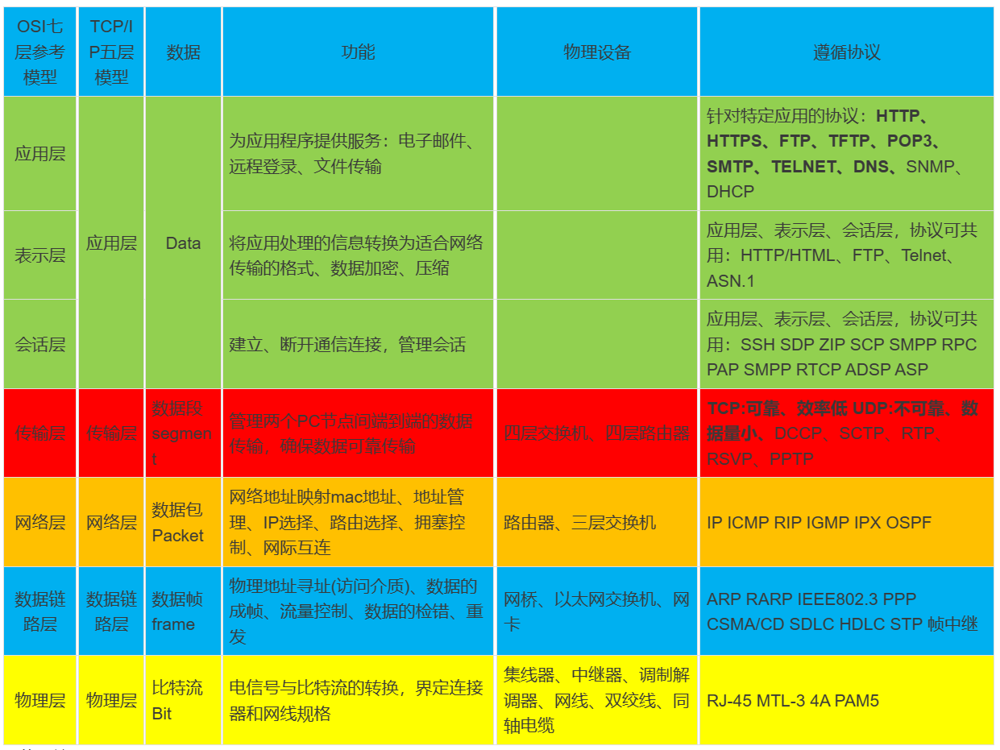
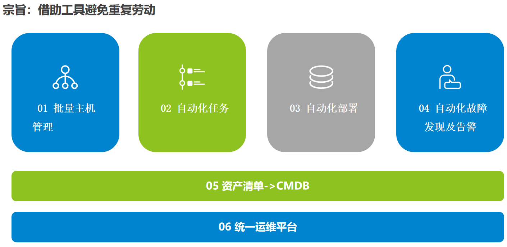
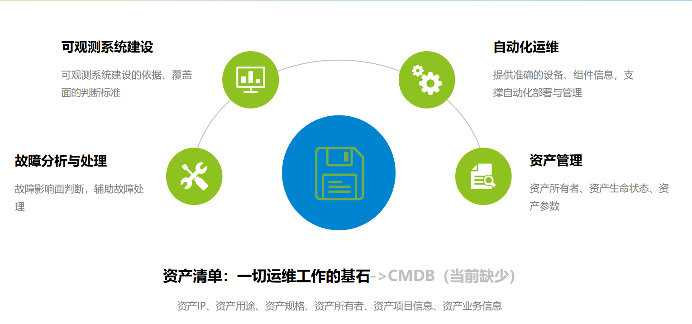

---
layout: post
title:  运维
category: dev-manage
tags: [dev-manage]
--- 
 
运维

## 参考资料 
- [鸟哥私房菜-基础学习篇]
- [鸟哥私房菜-服务器架设篇]
- [linux就该这么学]
- [kubernetes权威指南]
- [Kubernetes 中文指南/云原生应用架构实战手册]
- [prometheus-book](https://yunlzheng.gitbook.io/prometheus-book/)
- [SRE Google运维解密]
- [一个运维老将的自我修养](https://zhuanlan.zhihu.com/p/459028089)
- 运维分类：
	- 业务运维：主要是面向业务平台SaaS的；
	- 系统运维：比如负责网络，操作系统的、底层IaaS的等等；
	- 安全运维：负责信息安全的；
	- 数据库DBA：是专门负责数据库；
	- 运维开发：Devops（AIOps）负责开发运维工具和平台；
	- IT运维：负责企业网络、设备、资源池
- 名词解释：
    - IDC	 internet data center 互联网数据中心，简称IDC机房
    - 云、CDN、IDC 三个概念	https://www.zhihu.com/question/40534161

## 一、规范运维工作流程  
### 1.1 运维工作内容:    
 

### 1.2 制定维护作业计划:    
  

### 1.3 信息安全梳理:  
  

### 1.4 信息安全-敏感数据分级分类表:  

## 二、运维技术栈
### 2.0 虚拟化
- kvm
- vmware
- docker，k8s

### 2.1 Linux服务器基础 
- 用户、系统 
- CPU
- 内存
- 磁盘
- 网络 
- 文件管理
- 日志
- jumpServer
- iptables、firewall...
- ssl/https证书...

### 2.2 shell编程

### 2.3 DBA-灾备、恢复
- 灾备、恢复
    - 【容灾备份】【数据库】mysql数据库备份恢复方案
    - 【容灾备份】【数据库】PostGres数据库备份恢复方案
- 读写分离 
- 主备、主从复制
- 数据库监控 
- sql脚本 
- sql优化 

### 2.4 数据库/存储中间件
- Mysql 
    - 【数据库部署】MySQL 主从&一主多从
- Mycat 
    - 【中间件部署】Mycat
- Postgresql
    - 【数据库部署】PostgreSQL集群+PGPool集群
- PGPool
- Redis、
    - 【数据库部署】redis-cluster 5.x
    - 【数据库部署】redis哨兵模式
- MQ、
    - 【组件部署】kafka + zookeeper集群安装
    - 【组件部署】RabbitMQ集群安装
    - 【组件部署】RocketMQ双主双从集群部署
- ES
    - 【数据库部署】ES集群鉴权模式
- Mongodb、
    - 【数据库部署】MongoDB 3.4 分片副本集集群
- Fastdfs
    - 【存储部署】FastDFS + Nginx及鉴权
- Minio
- SeaweedFS
    - 【组件部署】SeaweedFS
- Ftp
- Zeekeeper
- clickhouse
    - 【数据库部署】clickhouse 安装  

### 2.5 服务器中间件
- JDK
    - 【组件部署】jdk安装
- nginx
    - 【组件部署】nginx
    - 【组件部署】keepalived + nginx 部署
- tomcat
- keepalived
    - 【中间件部署】Keepalived
    - 【组件部署】keepalived + haproxy部署
- HAProxy
    - 【中间件部署】HAProxy

### 2.6 高可用集群架构
- LVS + keepalived + Nginx 实现负载均衡、高可用集群
- LVS + HAProxy 提供高可用性、负载均衡以及基于TCP(第四层)和HTTP(第七层)应用的代理 

### 2.7 监控告警
告警系统建设的重要原则：规则随生产故障补充迭代
 
- 指标监控: 【Prometheus + Grafana】搭建监控平台
    - 01 基础设施指标：物理环境下为服务器、存储、网络设备等 基础硬件设施健康状态指标 云环境下为各类云服务的状态指标
    - 02 操作系统指标：CPU、内存、文件系统及其他标识操作系 统运行状态的指标
    - 03 业务进程指标：进程存活、进程CPU占用、进程内存占用、 进程文件打开数等标识进程运行状态的指 标
    - 04 应用程序指标：Kafka堆积数、Mysql连接数、 JVM堆内存、 Elasticsearch集群状态等应用级指标
    - 05 对外服务指标：网站响应时间、接口调用状态码、接口调并发支撑 用成功率等直接影响用户体验的指标
- 日志收集/监控：【ELK、Fluent bit、Loki 】搭建日志平台
    - 操作系统日志：用于安全审计、数据恢复等 系统运行日志：用于系统异常行为排查
    - 中间件日志：负载均衡、数据库、消息队列等中间件日 志：用于性能瓶颈分析、故障定位
    - 业务服务日志：用于用户行为分析、程序 bug定位、故障分析

### 2.8 网络 
[网络不通？服务丢包？ TCP 连接状态详解及故障排查](https://mp.weixin.qq.com/s?__biz=MzA4Nzg5Nzc5OA==&mid=2651719369&idx=1&sn=5d628d468ca444266226fba5e93cf6cc&chksm=8bc8c560bcbf4c76d450b04f16709434d70aad4b2d59684abbf8b7e5db74d9106c3b9689694a&scene=27)

- 抓包工具：wireshark
- 网络协议：Http、TCP/IP、UDP、ICMP（Internet Control Message Protocol 因特网报文控制协议）SIP...
- 四层网络
- 七层网络
- 网段（子网）、子网网关、子网掩码
- 寻址、路由
- DNS (Domain Name System) 域名系统，将域名和IP地址相互映射
- NAT（Network Address Translation）网络地址转换，在专用网内部的一些主机本来已经分配到了本地IP地址（即仅在本专用网内使用的专用地址），但又想和因特网上的主机通信（并不需要加密）时，可使用NAT，在专用网（私网IP）连接到因特网（公网IP）的路由器上安装NAT软件。装有NAT软件的路由器叫做NAT路由器
- CDN（Content Delivery Network）即内容分发网络

   

### 2.9 信息安全 
- rootkit：Rootkits是linux/unix获取root权限之后使得攻击者可以隐藏自己的踪迹和保留root访问权限的神器，通常攻击者使用 rootkit的检查系统查看是否有其他的用户登录
- fail2ban： 一款安全保护工具,触发限制后会创建防火墙规则封锁IP,诸如对ssh暴力破解、ftp/http密码穷举等场景提供强有力的保护
- ddos-defalte：是一款免费的用来防御和减轻DDoS攻击。它通过netstat监测跟踪创建大量网络连接的IP地址，在检测到某个结点超过预设的限制时，该程序会通过APF或iptables禁止或阻挡这些IP
- 安全扫描
- 渗透测试
- 定级备案
- 等保测评

### 2.10 CICD
- JDK
- Maven
- Nexus
- Sonar
- Gitlab、gitlab-ci: CI
- Jenkins: CICD
- Argocd：CD
    - 【CICD】00-云原生CICD流程
    - 【CICD】01-GitlabCI基础使用
    - 【CICD】02-Kustomize基础使用
    - 【CICD】03-ArgoCD基础使用 

### 2.11 云原生devops
- 镜像 image
- 容器 dcoker
    - 【云原生】Docker安装及使用
- 仓库 docker-registry、habor
    - 【云原生】harbor部署和使用
- 容器编排 k8s
    - 【云原生】使用 kind 创建 K8S 集群
    - 【云原生】使用 Kubespray 创建 K8S 集群
    - 【云原生】k8s集群接入私有镜像仓库
    - 【云原生】K3s单点部署
    - 【云原生】使用etcd部署K3S集群
    - 【云原生】部署Cilium作为CNI插件
    - 【云原生】部署flannel作为CNI插件
- 集群服务访问控制 ingress
- 集群管理：Rancher
    - 【云原生】Rancher部署和使用
- 部署：Argocd
    - 【云原生】Argocd部署和使用
- 服务网格：service mesh、Istio
- 公有云/私有云：云主机、云硬盘、VPC、子网、安全组、ACL、安全组规则-白名单、弹性公网IP、弹性负载均衡SLB、Net网关、对等连接、云专线...

### 2.12 大数据
- Hadoop
- Hdfs
- Hive
- Sqoop
- Flink
- CDH部署

### 2.13 自动化运维 & AIops

#### 2.13.1 批量主机管理
自动化工具选型：Ansible, 通过ansible批量下发执行操作命令   

示例：  
- 某系统与4A平台对接，需为系统内200台主机添加一条路由，打通与4A平台之间的网络
- 对某云资源池内的所有500台主机安装云安全中心agent

#### 2.13.2 自动化任务
自动化工具选型：Crontab + Python  

示例： 
- 每天、每月上传数据文件至ftp服务 
- 使用移动云提供的SDK及API调用示例，稍作修改，形成自动化添加安全组任务脚本

#### 2.13.3 自动化部署
自动化工具选型：    
- ansible批量下发执行命令脚本k3s-install.sh、
- ansible playbook编排
- CICD工具

#### 2.13.4 自动化故障 发现及告警
工具链推荐：Prometheus + Grafana

- 可观测性体系
    - 链路追踪 
    - 日志指标 
    - 可观测性体系
- 解决方案：Grafana全家桶
    - Tempo 
    - Loki 
    - Mimir  
- 其他推荐 
    - 可观测新标准：https://opentelemetry.io/ 
    - 新型可观测平台：https://signoz.io/ 
    - 可观测套件：https://github.com/observatorium/observatorium

#### 2.13.5 资产清单【CMDB】-一切运维工作的基石

#### 2.13.6 统一运维平台
运维平台：自动化运维能力集成  

推荐体验：腾讯蓝鲸智云 https://bk.tencent.com/

