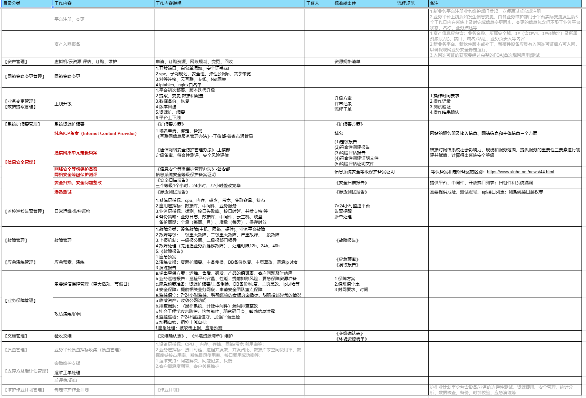

---
layout: post
title:  运维
category: dev-manage
tags: [dev-manage]
--- 
 
运维

## 参考资料 
- [一个运维老将的自我修养](https://zhuanlan.zhihu.com/p/459028089)
- 运维分类：
	- 业务运维，主要是面向业务的；
	- 系统运维，比如负责网络，操作系统的、底层IaaS的等等；
	- 数据库DBA，是专门负责数据库；
	- 安全运维，负责安全的；
	- 运维开发，Devops（AIOps）负责开发运维工具和平台；
	- IT运维：

## 一、规范运维工作流程  
### 1.1 运维工作内容:    
 

### 1.2 制定维护作业计划:    
  

### 1.3 信息安全梳理:  
  

### 1.4 信息安全-敏感数据分级分类表:  

## 二、运维技能培训 
### 2.1 Linux服务器基础 
- 基础命令 
- CPU、
- 内存、
- 硬盘、
- 网络 
- jumpServer
- iptables...

### 2.2 shell编程
 
### 2.3 DBA
- 备份、恢复
- 读写分离mycat
- 主备集群、主从复制
- 数据库监控 
- sql脚本 
- sql优化 

### 2.4 数据库、存储中间件：
- Mysql 
- Mycat 
- Postgresql
- PgPool
- Redis、
- Kafka、
- ES
- Mongodb、
- Fastdfs
- Ftp
- Zeekeeper

### 2.5 服务器中间件
- JDK
- nginx、
- tomcat、
- jetty

### 2.6 高可用集群架构
- LVS + keepalived + Nginx 实现负载均衡、高可用集群
- LVS + HAProxy 提供高可用性、负载均衡以及基于TCP(第四层)和HTTP(第七层)应用的代理 
 
### 2.7 监控
- 系统监控（cpu、内存、磁盘、带宽、）
- 应用监控:接口时延、并发QPS支持...
- 日志收集、监控
- ELK、
- Fluent bit
- 系统+业监控 Prometheus
- 系统监控 Zabbix
- 展示平台 Grafana

### 2.8 网络 
[网络不通？服务丢包？ TCP 连接状态详解及故障排查](https://mp.weixin.qq.com/s?__biz=MzA4Nzg5Nzc5OA==&mid=2651719369&idx=1&sn=5d628d468ca444266226fba5e93cf6cc&chksm=8bc8c560bcbf4c76d450b04f16709434d70aad4b2d59684abbf8b7e5db74d9106c3b9689694a&scene=27)

- 网络协议：Http、TCP/IP、UDP、ICMP（Internet Control Message Protocol 因特网报文控制协议）SIP...
- 四层网络
- 七层网络
- 子网掩码
- 寻址、路由
- DNS

### 2.9 安全 
- rootkit,md5, fail2ban,ddos-defalte

### 2.10 CICD
- Maven
- Nexus
- Sonar
- Gitlab、gitlab-ci: CI
- Jenkins: CD
- 自动化ansible 

### 2.11 云原生devops
- 镜像 image
- 容器 dcoker
- 仓库 docker-registry、habor
- 容器编排 k8s
- 集群服务访问控制 ingress
- 集群管理rancher
- Argocd
- 服务网格 service mesh、Istio
- 云资源开通配置：云主机、云硬盘、VPC、子网、安全组、ACL、白名单、弹性公网IP、弹性负载均衡SLB、NET网关、对等连接、云专线...

### 2.12 AIops

