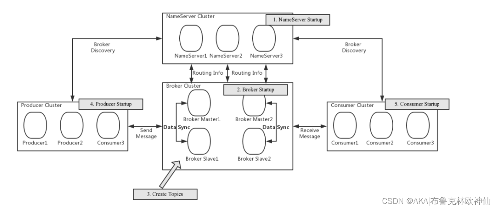

Rocketmq、监控平台rocketmq-dashboard部署

## 参考资料
- 官网地址： http://rocketmq.apache.org/
- 下载地址： http://rocketmq.apache.org/dowloading/releases/
- 文档地址： https://rocketmq.apache.org/zh/docs/4.x/deployment/01deploy
- 监控平台DashBoard:https://github.com/apache/rocketmq-dashboard
  - https://github.com/apache/rocketmq-dashboard/blob/master/docs/1_0_0/UserGuide_CN.md
- [CentOS 7.9下RocketMQ 4.9安装和配置手册](http://www.lushuiwan.com/3878.html)
- [RocketMQ集群搭建（双主双从）](https://blog.csdn.net/m0_54594153/article/details/127292626)
- [系列四、RocketMQ集群搭建（双主双从）](https://blog.csdn.net/HelloWorld20161112/article/details/131526951)


## 部署方式
- 单机模式：抗风险能力差，单机挂机没服务，单机硬盘损坏，丢失数据
- 多机（多master没有Slave副本）: 多个master采用RAID10磁盘，不会丢失数据，但是某一个master关闭，就获取不到该master的数据了。
- 多节点（集群）多副本模式-异步复制：多个master多个slave，主从之间**异步复制**
  - 优点：即使磁盘损坏，消息丢失的非常少，且消息实时性不会受影响，同时Master宕机后，消费者仍然可以从Slave消费，而且此过程对应用透明，不需要人工干预，性能同多Master模式几乎一样
  - 缺点：master宕机，可能丢失少量消息
- 多节点（集群）多副本模式-同步双写：多个master多个slave，主从之间**同步复制**每个Master配置一个Slave，有多对Master-Slave，HA采用同步双写方式，即只有主备都写成功，才向应用返回成功，这种模式的优缺点如下：
  - 优点：数据与服务都无单点故障，Master宕机情况下，消息无延迟，服务可用性与数据可用性都非常高；
  - 缺点：性能比异步复制模式略低（大约低10%左右），发送单个消息的RT会略高，且目前版本在主节点宕机后，备机不能自动切换为主机。

## 一、单机部署

## 二、RocketMQ双主双从集群部署(rocketmq-all-4.9.1-bin-release)
  

### 2.1 环境描述
| 主机名 | ip地址| 角色                 |
|---|---|--------------------|
|rocketmq01|1.1.1.1| broke-a nameserver |
|rocketmq02|1.1.1.2| broke-b nameserver |
|rocketmq03|1.1.1.3| broke-a-s          |
|rocketmq03|1.1.1.4| broke-b-s          |

### 2.2 安装配置
#### 准备工作

```
## 安装jdk
上传jdk-8u172-linux-x64.rpm  安装 rpm -ivh  jdk-8u281-linux-x64.rpm

# 官方地址 https://rocketmq.apache.org/release_notes/
wget http://mirrors.hust.edu.cn/apache/rocketmq/4.9.1/rocketmq-all-4.9.1-bin-release.zip

# 解压到/data文件夹
unzip rocketmq-all-4.9.1-bin-release.zip -d /data/rocketmq

# 调整目录
mv /data/rocketmq/rocketmq-all-4.9.1-bin-release/* /data/rocketmq/ 
rm -r /data/rocketmq/rocketmq-all-4.9.1-bin-release/
```

#### 创建文件夹
```
# rocketmq01创建broker-a的master服务需要的文件夹
mkdir -p /data/rocketmq/store /data/rocketmq/store/consumequeue /data/rocketmq/store/commitlog /data/rocketmq/store/index /data/rocketmq/data/store/checkpoint /data/rocketmq/data/store/abort /data/rocketmq/logs

# rocketmq02创建broker-b的master服务需要的文件夹
mkdir -p /data/rocketmq/store /data/rocketmq/store/consumequeue /data/rocketmq/store/commitlog /data/rocketmq/store/index /data/rocketmq/data/store/checkpoint /data/rocketmq/data/store/abort /data/rocketmq/logs

# rocketmq03创建broker-a-s的slave服务需要的文件夹
mkdir -p /data/rocketmq/store /data/rocketmq/store/consumequeue /data/rocketmq/store/commitlog /data/rocketmq/store/index /data/rocketmq/data/store/checkpoint /data/rocketmq/data/store/abort /data/rocketmq/logs

# rocketmq04创建broker-b-s的slave服务需要的文件夹
mkdir -p /data/rocketmq/store /data/rocketmq/store/consumequeue /data/rocketmq/store/commitlog /data/rocketmq/store/index /data/rocketmq/data/store/checkpoint /data/rocketmq/data/store/abort /data/rocketmq/logs
```

#### 修改配置文件
修改4台服务器目录/data/rocketmq/conf/2m-2s-sync下的四个文件(broker-a.properties,broker-a-s.properties,broker-b.properties,broker-b-s.properties)，以broker-a.properties为基础，其余配置文件参数微调

1.broker-a.properties 
```
brokerClusterName=DefaultCluster
brokerName=broker-a
brokerId=0
deleteWhen=04
fileReservedTime=48
#主从同步双写
brokerRole=SYNC_MASTER
#异步刷盘
flushDiskType=ASYNC_FLUSH
#nameServer地址，分号分割
namesrvAddr=1.1.1.1:9876;1.1.1.2:9876
storePathRootDir=/data/rocketmq/store
#commitLog 存储路径
storePathCommitLog=/data/rocketmq/store/commitlog
#消费队列存储路径存储路径
storePathConsumeQueue=/data/rocketmq/store/consumequeue
#消息索引存储路径
storePathIndex=/data/rocketmq/store/index
#checkpoint 文件存储路径
storeCheckpoint=/data/rocketmq/store/checkpoint
#abort 文件存储路径
abortFile=/data/rocketmq/store/abort
```

2.broker-a-s.properties  
```
brokerRole=SLAVE
```

3.broker-b.properties  
```
brokerName=broker-b
```

4.broker-b-s.properties  
```
brokerName=broker-b
brokerRole=SLAVE
```

修改日志路径    
修改每台服务器/data/rocketmq/conf下的logback_broker.xml、logback_tools.xml、logback_namesrv.xml文件
${user.home}改为/data

### 2.3 服务启动和关闭

### 服务启动内存修改
#### 内存不足时可修改配置文件
```
vim /data/rocketmq/bin/runserver.sh
vim /data/rocketmq/bin/runbroker.sh

JAVA_OPT="${JAVA_OPT} -server -Xms2g -Xmx2g -Xmn1g
```

#### RocketMQ 启动
```
启动时注意各个服务的顺序: 必须先启动nameserver服务,启动broker服务时先启动master，再启动slave

# 先启动rocketmq01与rocketmq02的nameserver服务
nohup sh /data/rocketmq/bin/mqnamesrv  &

# 启动rocketmq01的master服务
nohup sh /data/rocketmq/bin/mqbroker -c /data/rocketmq/conf/2m-2s-sync/broker-a.properties >> /data/rocketmq/logs/broker-a.log 2>&1 &

# 启动rocketmq03的slave服务
nohup sh /data/rocketmq/bin/mqbroker -c /data/rocketmq/conf/2m-2s-sync/broker-a-s.properties >> /data/rocketmq/logs/broker-a-s.log 2>&1 &

# 启动rocketmq02的master服务
nohup sh /data/rocketmq/bin/mqbroker -c /data/rocketmq/conf/2m-2s-sync/broker-b.properties >> /data/rocketmq/logs/broker-b.log 2>&1 &

# 启动rocketmq04的slave服务
nohup sh /data/rocketmq/bin/mqbroker -c /data/rocketmq/conf/2m-2s-sync/broker-b-s.properties >> /data/rocketmq/logs/broker-b-s.log 2>&1 &

```

#### RocketMQ 关闭
```
sh mqshutdown namesrv
sh mqshutdown broker
```

## 三、监控面板 [RocketMQ Dashboard](https://rocketmq.apache.org/zh/docs/4.x/deployment/03Dashboard/)
RocketMQ-双主双从集群+DashBorad搭建(云服务器) https://blog.csdn.net/m0_49183244/article/details/128413361
``` 
第一步、下载并解压 
dashboard仓库：https://github.com/apache/rocketmq-dashboard。下载zip包并解压。

第二步、修改配置文件
修改rocketmq.config.namesrvAddr=后面为你的NameServer集群地址
修改 server.port=8081 ## 移动云默认80  443端口不开放，备案后才可以开通

第三步、编译打包并部署
cmd 进入 /rocketmq-dashboard-master 目录 
执行编辑打包命令：
mvn clean package -Dmaven.test.skip=true
mvn clean package -DskipTests=true
等待命令执行完成之后在/rocketmq-dashboard-master/target 目录下可以看到打好的jar包 传到服务器 
修改权限：chmod 755 rocketmq-dashboard-1.0.1-SNAPSHOT.jar  
启动：nohup-DskipTests=true java -jar rocketmq-dashboard-1.0.1-SNAPSHOT.jar &> store/log.log & 

第四步：访问：  
ip:port
```

## 四、常用命令
``` 
# 查询集群状态
mqadmin clusterList -n '{rocketmq连接地址1};{rocketmq连接地址2}'
 
# 查看指定cluster的的响应时间（每次发5条消息，单条消息大小为100Bytes，间隔10s刷新，以tlog的格式打印数据）
mqadmin clusterRT -n '{rocketmq连接地址1};{rocketmq连接地址2}' -s 100 -a 5 -i 10 -p true

# 查看topic
sh mqadmin topicList -n 127.0.0.1:9876

# 重置消费进度
sh mqadmin resetOffsetByTime -g xx_topic_consumer_group -n 127.0.0.1:9876 -s '2023-09-04#23:00:00:333' -t xx_topic 
```
