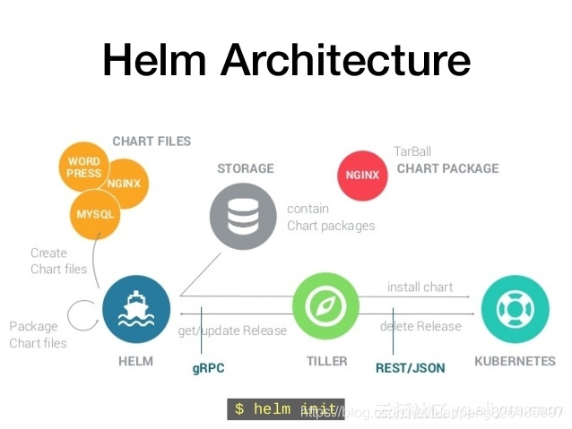

k8s应用管理-helm

## 参考资料
- [官网](https://helm.sh/docs/intro/)
- https://www.coderdocument.com/docs/helm/v2/index.html
- [helm的简介](https://luanpeng.blog.csdn.net/article/details/82219197)
- [k8s上安装并初始化Helm,helm基础使用教程](https://luanpeng.blog.csdn.net/article/details/80873236)

## 1.helm简介
Helmk是k8s的包管理工具，Helm之于Kubernetes好比yum之于RHEL，或者apt-get之于Ubuntu。Helm使用Chart帮助管理应用，Chart就好像RPM一样，里面描述了应用及其依赖关系。主要概念：  

  

- helm客户端：命令行客户端工具，负责管理charts、reprepository和release。它通过gPRC API（使用kubectl port-forward将tiller的端口映射到本地，然后再通过映射后的端口跟tiller通信）向tiller发送请求
- tiller服务端：tiller接收来自helm客户端的请求，并把相关资源的操作发送到Kubernetes，负责管理（安装、查询、升级或删除等）和跟踪Kubernetes资源。为了方便管理，tiller把release的相关信息保存在kubernetes的ConfigMap中。 tiller对外暴露gRPC API，供helm客户端调用
- Chart：Helm管理的kubernetes资源包称之为Chart，Chart是一个结构相对固定的文件目录，是应用的描述，Chart之间可相互依赖
- Repository：Helm package存储仓库
- Release：Chart部署之后的实例，每一次helm install运行后就会生成一个新的release，在k8s中创建出真是运行的资源对象 

Helm引入是为了解决哪些问题  
- 1.把yaml作为整体管理
- 2.实现yaml高效服用
- 3.使用helm进行应用级别的版本管理

## 2.helm安装
``` 
## 安装Helm包管理器
$ wget https://get.helm.sh/helm-v3.6.3-linux-amd64.tar.gz
$ tar -zxvf helm-v3.6.3-linux-amd64.tar.gz
$ sudo mv linux-amd64/helm /usr/local/bin/helm

## 验证：
$ helm version 
```

## 3.使用helm安装组件示例-ingress-nginx
``` 
$ helm repo add ingress-nginx https://kubernetes.github.io/ingress-nginx
$ helm repo update
$ helm pull ingress-nginx/ingress-nginx
$ tar -zxvf ingress-nginx-4.0.6.tgz

## 修改value参数
$ vim ingress-nginx/values.yaml

## 创建命名空间
$ kubectl create namespace ingress-nginx

## 安装，./ingress-nginx为解压后的包目录
$ helm install ingress-nginx ./ingress-nginx -n ingress-nginx

## 查看安装状态
$ kubectl get po -n ingress-nginx

## 卸载
$ helm uninstall ingress-nginx -n ingress-nginx
```

## 问题记录