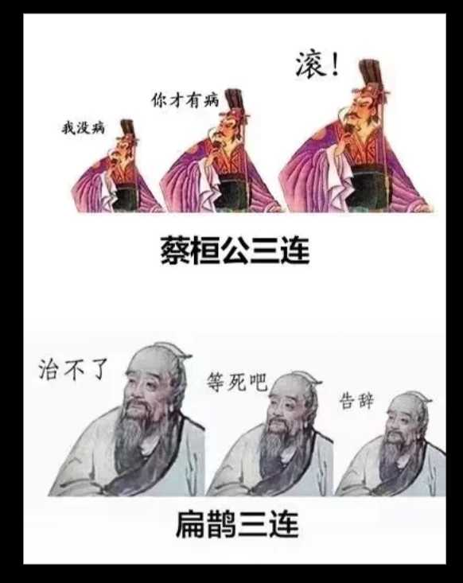

设计原则

## 参考资料
- https://blog.csdn.net/itcodexy/article/details/121724813
- http://www.cnblogs.com/lanxuezaipiao/archive/2013/06/09/3128665.html
- https://www.iteye.com/blog/zz563143188-1847029

## 一、前言

软件也像人一样，具有生命力，从出生到死亡，会经历多种变化。软件架构设计也不是一蹴而就的，是不断地演进发展。每个程序员都可以从理解编程原则和模式中受益。

软件设计原则是一组帮助我们避开不良设计的指导方针。根据`Robert Martin`的理论，应该避免不良设计的以下三个重要特点：

- **僵化**：很难做改动，因为每一个细微的改动都会影响到系统大量的其他功能
- **脆弱**：每当你做一次改动，总会引起系统中预期之外的部分出现故障
- **死板**：代码很难在其他应用中重用，因其不能从当前应用中单独抽离出来

下面这些软件设计原则是我从一些书籍和网络中收集而来，并不完整，而且你也需要在一些有“冲突的原则”之间进行权衡和取舍。本文或许会对你的编程、程序设计、讨论或评审工作有所帮助。

## 二、面向对象设计原则

### OCP(`Open Closed Principle`)开闭原则

所谓`OCP`原则，即：`Open Closed Principle`，**开闭原则**。原始定义如下：

> software entities (classes, modules, functions, etc.) should be open for extension, but closed for modification.(对扩展开放，对修改关闭)

开闭原则（`OCP`）是面向对象设计中“可复用设计”的基石，是面向对象设计中最重要的原则之一，其它很多的设计原则和设计模式都是实现开闭原则的一种手段。

核心就是：**对扩展开放，对修改关闭**。其含义是说一个软件应该通过扩展来实现变化，而不是通过修改已有的代码来实现变化的。
 
软件系统中包含的各种组件，例如模块（`Module`）、类（`Class`）以及功能（`Function`）等等，应该在不修改现有代码的基础上，引入新功能。开闭原则中“开”，是指对于组件功能的扩展是开放的，是允许对其进行功能扩展的；开闭原则中“闭”，是指对于原有代码的修改是封闭的。

实现开闭原则的关键就在于“**抽象**”。把系统的所有可能的行为抽象成一个抽象底层，这个抽象底层规定出所有的具体实现必须提供的方法的特征。作为系统设计的抽象层，要预见所有可能的扩展，从而使得在任何扩展情况下，系统的抽象底层不需修改；同时，由于可以从抽象底层导出一个或多个新的具体实现，可以改变系统的行为，因此系统设计对扩展是开放的。在实际开发过程的设计开始阶段，就要罗列出来系统所有可能的行为，并把这些行为加入到抽象底层，根本就是不可能的，这么去做也是不经济的。因此我们应该现实的接受修改拥抱变化，使我们的代码可以对扩展开放，对修改关闭。

开闭原则的好处：

- 可复用性好;
- 可维护性好。

### 1. SRP(`Single Responsibility Principle`)单一职责原则

所谓`SRP`原则，即：`Single Responsibility Principle`，**单一职责原则**。原始定义如下：

> There should never be more than one reason for a class to change.(**只有一个引起类改变的原因**)

在面向对象编程领域中，单一职责原则（`Single responsibility principle`）规定每个类都应该有一个单一的职责或者叫功能，并且该功能应该由这个类完全封装起来。所有它的（这个类的）服务都应该严密的和该功能平行（功能平行，意味着没有依赖）。一个类或者模块应该有且只有一个改变的原因。如若不然， 就应该把类拆分。

如果一个类承担的职责过多，就等于把这些职责耦合在一起了。一个职责的变化可能会削弱或者抑制这个类完成其他职责的能力。这种耦合会导致脆弱的设计，当发生变化时，设计会遭受到意想不到的破坏。而如果想要避免这种现象的发生，就要尽可能的遵守单一职责原则。此原则的核心就是**解耦**和**增强内聚性**。

**单一职责的好处：**

- 类的复杂性降低，实现什么职责都有清晰明确的定义;
- 可读性提高，复杂性降低，可维护性提高;
- 变更引起的风险降低。

**单一职责原则的注意点：**

- 单一职责最难划分的是**职责**。
- 单一职责原则提出标准：用职责和变化原因来衡量接口或类设计的是否优良，但是职责和变化原因都是不可度量的，因项目、环境而异。
- 接口一定要做到单一职责，类的设计尽量做到只有一个原因引起它变化。

### 2. LSP(`Liskov Substitution principle`)里氏替换原则

所谓`LSP`原则，即：`Liskov Substitution principle`，**里氏替换原则**。原始定义如下：

> Functions that use pointers of references to base classes must be able to use objects of derived classes without knowing it.（**所有引用基类的地方必须能透明地使用其子类的对象**）

更通俗的定义即为：**子类可以扩展父类的功能，但不能改变父类原有的功能**。里氏替换原则包含了一下含义：  
- 任何基类可以出现的地方， 子类一定可以出现。
- LSP是继承复用的基石， 只有当衍生类可以替换掉基类， 软件单位的功能不受到影响时， 基类才能真正被复用， 而衍生类也能够在基类的基础上增加新的行为。
- 子类必须完全实现父类的方法。在类中调用其他类是务必要使用父类或接口，如果不能使用父类或接口，则说明类的设计已经违背了`LSP`原则。
- 子类可以有自己的个性。子类当然可以有自己的行为和外观了，也就是方法和属性。
- 覆盖或实现父类的方法时输入参数可以被放大。即子类可以覆盖父类的方法，但输入参数应比父类方法中的大，这样在子类代替父类的时候，调用的仍然是父类的方法。即以子类中方法的前置条件必须与超类中被覆盖的方法的前置条件相同或者更宽松。
- 覆盖或实现父类的方法时输出结果可以被缩小。
- 里氏代换原则是对“开-闭”原则的补充。 实现“开-闭”原则的关键步骤就是抽象化。 而基类与子类的继承关系就是抽象化的具体实现， 所以里氏代换原则是对实现抽象化的具体步骤的规范。
- 里氏替换原则中， 子类对父类的方法尽量不要重写和重载。 因为父类代表了定义好的结构， 通过这个规范的接口与外界交互， 子类不应该随便破坏它

**优点:**

- 提高代码的重用性，子类拥有父类的方法和属性；
- 提高代码的可扩展性，子类可形似于父类，但异于父类，保留自我的特性；

**缺点:**

- 继承是侵入性的，只要继承就必须拥有父类的所有方法和属性，在一定程度上约束了子类，降低了代码的灵活性；
- 增加了耦合，当父类的常量、变量或者方法被修改了，需要考虑子类的修改，所以一旦父类有了变动，很可能会造成非常糟糕的结果，要重构大量的代码。

### 3. ISP(`Interface Segregation Principle)接口隔离原则

所谓`ISP`原则，即：`Interface Segregation Principle`，**接口隔离原则**。原始定义如下：

> Clients should not be forced to depend upon interfaces that they do not use.(客户端只依赖于它所需要的接口；它需要什么接口就提供什么接口，把不需要的接口剔除掉。)

> The dependency of one class to another one should depend on the smallest possible interface.(类间的依赖关系应建立在最小的接口上。即**接口尽量细化，接口中的方法尽量少**。)

接口隔离原则与单一职责原则的审视角度是不同的，  
- 单一职责原则要求的是类和接口职责单一，注重的是职责，这是业务逻辑上的划分;   
- 接口隔离原则要求接口的方法尽量少,目的是减少依赖，降低耦合。 

采用接口隔离原则对接口进行约束时，要注意以下几点：  
- 接口尽量小，但是要有限度。对接口进行细化可以提高程序设计灵活性是不挣的事实，但是如果过小，则会造成接口数量过多，使设计复杂化。所以一定要适度。
- 为依赖接口的类定制服务，只暴露给调用的类它需要的方法，它不需要的方法则隐藏起来。只有专注地为一个模块提供定制服务，才能建立最小的依赖关系。
- 提高内聚，减少对外交互。使接口用最少的方法去完成最多的事情。

运用接口隔离原则，一定要适度，接口设计的过大或过小都不好。设计接口的时候，只有多花些时间去思考和筹划，才能准确地实践这一原则。

### 4. DIP(`Dependency Inversion Principle`)依赖倒置原则

所谓`DIP`原则，即：`Dependency Inversion Principle`，**依赖倒置原则**。原始定义如下：

> High-level modules should not depend on low-level modules. Both should depend on abstractions.(**高层模块不应该依赖低层模块，两者都应该依赖其抽象**)

> Abstractions should not depend on details. Details should depend on abstractions.(**抽象不应该依赖细节；细节应该依赖抽象**)

面向过程的开发，上层调用下层，上层依赖于下层，当下层剧烈变动时上层也要跟着变动，这就会导致模块的复用性降低而且大大提高了开发的成本。面向对象的开发很好的解决了这个问题，一般情况下抽象的变化概率很小，让用户程序依赖于抽象，实现的细节也依赖于抽象。即使实现细节不断变动，只要抽象不变，客户程序就不需要变化。这大大降低了客户程序与实现细节的耦合度。

依赖倒置原则主要有以下三层含义：

- 高层模块不应该依赖低层模块，两者都应该依赖其抽象（抽象类或接口）；
- 抽象不应该依赖细节（具体实现）；  
- 细节（具体实现）应该依赖抽象。

依赖倒置原则基于这样一个事实：**相对于细节的多变性，抽象的东西要稳定的多**。以抽象为基础搭建起来的架构比以细节为基础搭建起来的架构要稳定的多。在 Java 中，抽象指的是接口或者抽象类，细节就是具体的实现类，使用接口或者抽象类的目的是制定好规范和契约，而不去涉及任何具体的操作，把展现细节的任务交给他们的实现类去完成。**依赖倒置原则的核心思想就是面向接口编程**。

### 5. LOD | LKP(`Law of Demeter`)迪米特法则，又叫**最少知识原则**（`Least Knowledge Principle`）

就是说一个对象应当对其他对象有尽可能少的了解。通俗的讲，一个类应该对自己需要耦合或调用的类知道得最少，被耦合的类是如何的复杂都和我没关系，即为“不和陌生人说话”。迪米特法则的英文解释如下：

> talk only to your immediate friends.(**只与直接的朋友通信**)

**迪米特法则的初衷在于降低类之间的耦合**。由于每个类尽量减少对其他类的依赖，因此，很容易使得系统的功能模块功能独立，相互之间不存在（或很少有）依赖关系。

迪米特法则不希望类之间建立直接的联系。如果真的有需要建立联系，也希望能通过它的“朋友”类来转达。因此，应用迪米特法则有可能造成的一个后果就是：系统中存在大量的中介类，这些类之所以存在完全是为了传递类之间的相互调用关系——这在一定程度上增加了系统的复杂度,同时也为系统的维护带来了难度。所以，在采用迪米特法则时需要反复权衡，不遵循不对，严格执行又会“过犹不及”。既要做到让结构清晰，又要做到高内聚低耦合。

耦合分为：依赖、 关联、 聚合、 组合等。  
我们称出现为成员变量、 方法参数、 方法返回值中的类为直接朋友。 局部变量、 临时变量则不是直接的朋友。  
我们要求陌生的类不要作为局部变量出现在类中。  

### 6. CRP(`Composite Reuse Principle)组合复用原则

所谓`CRP`原则，即：`Composite Reuse Principle`，**组合复用原则**。

组合复用原则的核心思想是：**尽量使用对象组合，而不是继承来达到复用的目的**。该原则就是在一个新的对象里面使用一些已有的对象，使之成为新对象的一部分：新的对象通过向这些对象的委派达到复用已有功能的目的。

继承的缺点主要有以下几点：

- 继承复用破坏数据封装性，将基类的实现细节全部暴露给了派生类，基类的内部细节常常对派生类是透明的，白箱复用。虽然简单，但不安全，不能在程序的运行过程中随便改变。
- 基类的实现发生了改变，派生类的实现也不得不改变。
- 从基类继承而来的派生类是静态的，不可能在运行时间内发生改变，因此没有足够的灵活性。

由于组合可以将已有的对象纳入到新对象中，使之成为新对象的一部分，因此新对象可以调用已有对象的功能，这样做有下面的好处：

- 新对象存取`组成对象`的唯一方法是通过`组成对象`的`getter/setter`方法。
- 组合复用是黑箱复用，因为组成对象的内部细节是新对象所看不见的。
- 组合复用所需要的依赖较少。
- 每一个新的类可以将焦点集中到一个任务上。
- 组合复用可以在运行时间动态进行，新对象可以动态的引用与成分对象类型相同的对象。

组合复用的缺点：就是用组合复用建造的系统会有较多的对象需要管理。

组合复用原则可以使系统更加灵活，类与类之间的耦合度降低，一个类的变化对其他类造成的影响相对较少，因此一般首选使用组合来实现复用；其次才考虑继承。在使用继承时，需要严格遵循里氏代换原则，有效使用继承会有助于对问题的理解，降低复杂度，而滥用继承反而会增加系统构建和维护的难度以及系统的复杂度，因此需要慎重使用继承复用。

使用继承时必须满足`Is-A`的关系是才能使用继承，而组合却是一种`Has-A`的关系。导致错误的使用继承而不是使用组合的一个重要原因可能就是错误的把`Has-A`当成了`Is-A`。

## 三、扩展：通用设计原则

### 1. KISS(`Keep It Simple,Stupid`)坚持简约

所谓`KISS`原则，即：`Keep It Simple,Stupid`，指**设计时要坚持简约原则，避免不必要的复杂化，并且易于修改**。

> Everything should be made as simple as possible, but not simpler. - Albert Einstein

简单清晰、功能强大是软件设计最重要的原则和目标。但是软件工程天然错综复杂，而“简单”却没有一个衡量标准，判断和实现一个东西是不是简单，可以通过以下方式来参考。

- 让别的软件工程师以一种最容易的方式使用你的方案。
- 简单不是走捷径，不是为手边的问题找一个最快的方案。
- 当系统变得更庞大更复杂的时候依然能够被理解。
- 如果系统无法保持简单，那么我们能做的就是保持各个局部简单，即任何单个的类、模块、应用的设计目标及工作原理都能被快速理解。

> **我的理解**：保持简单但不能掩盖软件丰富的内涵。即**简约而不简单**！简约是对复杂的事物抽丝剥茧、去除细枝末节显露主要逻辑的过程。就像小时候老师教写文章，要求尽可能用朴实的语言，言简意赅的写出来，但却又要避免语言过于贫乏。软件的“抽象”和它的“直观性”，其实是一对矛盾的关系，软件设计就要保证这两者的平衡。代码抽象过于复杂会陷入“过度设计”不易理解的困境；为了“直观性”缺乏抽象，长此以往又会出现大量的重复、不易于扩展和难维护的困境。

### 2. DRY(`Don't Repeat Yourself`)不要让自己重

所谓`DRY`原则，即：`Don't Repeat Yourself`，**不要让自己重复**。

**重复代码是软件程序变烂的万恶之首**。`DRY`并不是指你不能复制代码，而是你复制的代码不能包含重复的“信息”。复制的东西并不仅仅是复制了代码，而是由于你把同一个信息散播在了代码的各个部分导致了有很多相近的代码也散播在各个地方。代码之所以要写的好，不要重复某些“信息”，因为需求人员总是要改需求，不改代码你就要“死”，改代码你就要加班，所以为了减少修改代码的痛苦，我们不能重复任何信息。举个例子，有一天需求人员说，要把分隔符从分号改成顿号！一下子就要改多个地方了。

所以，**去掉重复的信息会让你的代码结构发生本质的变化**。

“重复代码”有很多变体：

- 魔法数字、魔法字符串等
- 相同代码块
- 相似的代码逻辑及操作

对于消除重复的代码有**事不过三**法则。

- 第一次先写了一段代码。
- 第二次在另一个地方写了一段相同或相似逻辑的代码，你已经有消除和提取重复代码的冲动了。
- 再次在另一个地方写了同样的代码，你已忍无可忍，现在可以考虑抽取和消除重复代码了。

> **我的理解**：解决重复的最佳的方式是通过培养良好的编码习惯来避免重复，通过重构的手段来消除重复。发现和解决重复并不困难，通过提取抽象、提取方法等措施就能消除重复，但困难的是**立即行动**去解决重复，从而不断的磨砺和提升自己的编程技艺，不断将私人代码变成公共代码，这才是自我提升的过程。解决了重复，经过一段时间，你就会发现，你对整个系统的理解程度在不知不觉中提高了不少。

### 3. Maximize Cohesion， Minimize Coupling高内聚低耦合

所谓`Maximize Cohesion,Minimize Coupling`原则，即：**高内聚低耦合**。这是判断设计好坏的标准，主要是看**模块内的内聚性是否高，模块间的耦合度是否低。**

- **耦合性**：也称块间联系。指软件系统结构中各模块间相互联系紧密程度的一种度量。模块之间联系越紧密，其耦合性就越强，模块的独立性则越差。模块间耦合高低取决于模块间接口的复杂性、调用的方式及传递的信息。耦合是软件结构中各模块之间相互连接的一种度量，耦合强弱取决于模块间接口的复杂程度、进入或访问一个模块的点以及通过接口的数据。
- **内聚性**：又称块内联系。指模块的功能强度的度量，即一个模块内部各个元素彼此结合的紧密程度的度量。若一个模块内各元素（语名之间、程序段之间）联系的越紧密，则它的内聚性就越高。内聚是从功能角度来度量模块内的联系，一个好的内聚模块应当恰好做一件事。它描述的是模块内的功能联系。

内聚和耦合是密切相关的，同其他模块存在高耦合的模块意味着低内聚，而高内聚的模块意味着该模块同其他模块之间是低耦合。在进行软件设计时，应力争做到高内聚，低耦合。

Java中实现高内聚低耦合的常用方式：

- 少使用类的继承，多用接口隐藏实现的细节。
- 模块的功能化分尽可能的单一，道理也很简单，功能单一的模块供其它模块调用的机会就少。
- 遵循一个定义只在一个地方出现。
- 少使用全局变量。
- 类属性和方法的声明少用`public`，多用`private`关键字，
- 多用设计模式，比如采用`MVC`的设计模式就可以降低界面与业务逻辑的耦合度。
- 尽量不用“硬编码”的方式写程序。
- 最后当然就是避免直接操作或调用其它模块或类（内容耦合）。

### 4. SOC(`Separation of Concerns`)关注点分离

所谓`SOC`原则，即：**关注点分离**（`Separation of Concerns`）。**不同领域的功能，应该由不同的代码和最小重迭的模块组成。**关注点分离是处理复杂性的一个原则。由于关注点混杂在一起会导致软件程序复杂性大大增加，所以能够把不同的关注点分离开来，分别处理就是处理复杂性的一个原则，一种方法。关注点分离原则不仅体现在软件程序设计等设计方法中，同时也体现在架构设计、问题求解、软件开发过程、软件项目管理以及软件开发方法学等诸多方面。

`MVC`就是关注点分离的一个体现，把业务逻辑、数据、界面分离，这也是组织代码结构的一个形式。`MVC`的基本结构：

- `Model`层表示应用程序的数据核心，通常负责在数据库中存取数据。
- `View`是应用程序的显示层，通常是依据模型的数据而建立。
- `Controller`是用来控制和处理输入输出的，是处理用户交互的部分，也负责向模型（`Model`层）发送数据。

`MVC`的这个设计各个关注点是分开的，这样有助于我们管理和开发复杂的应用程序，我们可以在某个时间点只集中精力在其中的某一个关注点，而不是所有的部分。

> 好的架构必须使每个关注点相互分离，也就是说系统中的一个部分发生了变化，不会影响其他部分。即使需要改变，也能够清晰地识别出那些部分需要改变。如果需要扩展架构，影响将会最小化，已经可以工作的每个部分都将继续工作。——Ivar Jacobson(《AOSD中文版》)

**分离方式** 

下面将介绍一些分层的思想和方式:

- **纵向分离**: 如常见的三层架构（逻辑控制层、业务处理层和数据持久化层）。
- **横向分离**: 如把我们的软件拆分成模块或子系统。从左到右是模块1、模块2、模块3，这是一种水平方向的切割。这跟纵向的分离是两个不同的方向，横向分离大多是模块化的过程。
- **切面分离**: 有些内容是多个层之间都需要的，比如日志（`log`），在你的系统里面，界面层、逻辑层、数据访问层可能都需要写日志，这种跨到多层同样逻辑就可以考虑切面分离。
- **依赖方向分离**: 按依赖方向考虑，决定某个类应该放在哪个层次里面，或者考虑将某一层切割成多层。
- **关注数据分离**: 在组织数据时，应该尽量考虑数据本身的固有属性，如果不是它们的固有属性，那么应该分离出来。比如产品的类就不应该关联`customer`类，应该是用订单类来把他们联系在一起。
- **关注行为分离**: 行为也应该是事物或对象的固有的本身的行为，明显偏离原来行为的，应该考虑成另外的关注点儿分离开。比如有一个函数叫做`CreateNewCustomer()`，那么`CreateNewCustomer()`的行为就应该限定在创建一个新客户上面，给新客户自动发优惠券的动作就不能放到这个函数里面。
- **扩展分离**: 如果基于某种设计，原先不具有某些行为需要增加，可以考虑通过扩展或插件的形式来完成，将这些功能放入到插件或扩展中。
- **反转分离**: 很多依赖注入的框架，如`Spring`、`Guice`等等，这些帮助我们做依赖反转，从而倒置依赖关系。

### 5. YAGNI(：`You Ain’t Gonna Need It`)你不需要它

所谓`YAGNI`原则，即：`You Ain’t Gonna Need It`，**你不需要它**。它是一种极限编程（XP）实践，表示程序员不应为目前还不需要的功能编写代码。`YAGNI`很像`KISS`原则，因为它也是致力于构建简单的方案。然而，`KISS`是通过尽可能容易的完成某件事情来实现精简方案；但`YAGNI`是通过根本就不实现它来达到精简。`YAGNI`的观点是你应该**为了眼前的需求做设计而不是未来**。

> 只在真正需要某些功能的时候才去实现它，而不是仅仅因为你预见到它将出现。- XP的联合创始人Ron Jeffries

即使你非常确信将来你需要某个特性，也不要现在就去实现它。在很多情况下，你会发现或许最终你不需要它了，或者是你真正所需的特性与你之前预计的有很大的出入。遵循 YAGNI 实践有两个主要原因：

- 你节约了时间，因为你避免了编写最终证明不必要的代码。
- 你的代码质量更高了，因为你使代码不必为你的“推测”所污染，而这些“推测”最终可能或多或少有些错误，但此时这些错误已牢牢地依附在你的代码中了。

> **我的理解**：YAGNI 原则，本质上是告诫我们**写代码不要画蛇添足，否则就会弄巧成拙了**。编写业务代码时，不要去假想一些需求或者场景，因为大多数你所设想的场景都不会发生，而你所多写的那些代码也将会长期滞留在你的系统中，收效甚微，但却让你和团队花费了更多的时间和精力去书写和维护，更可怕的是可能会对将来新的代码维护人造成困惑。另外对于没有被使用到的代码，我认为也都应该立即删除，从而保持系统的精简，如果将来需要时再去书写或恢复，而且那时侯写出的代码也绝对比之前的更为契合。

### 6. Boy-Scout Rule童子军规则

`Boy-Scout Rule`，译为：**童子军规则**。美国童子军有一个简单的规则：“让营地比你刚来时更干净(`Always leave the campground cleaner than you found it`)”。如果看到地上有垃圾，不管是谁扔的，都要清理。这样你就有意地为下一批来宿营的人改善了环境。

童子军规则告诉我们在对现有代码库进行更改时，代码质量往往会降低，从而积累技术债务。所以需要**始终保持代码整洁**。不管原作者是谁，如果我们努力去改进代码模块，不管是多么小的改进，我们的软件系统就再也不会持续变坏了。取而代之的是，系统在发展的同时会逐渐变得更好。我们也会看到团队们关心整体的系统，而不是各自只关心自己负责的一小部分。而且团队成员要互助，互相清理代码，他们遵从童子军规则，因为那对每个人都很好，而不仅仅是对自己好。

关于童子军规则中所提倡的**对代码坏味道的尽早修复**，我也想起来了我们所熟知的“**破窗效应**”和“**讳疾忌医**”的典故：

**破窗效应**

> 如果有人打坏了一幢建筑物的窗户玻璃，而这扇窗户又得不到及时的维修，别人就可能受到某些示范性的纵容去打烂更多的窗户。久而久之，这些破窗户就给人造成一种无序的感觉，结果在这种公众麻木不仁的氛围中，犯罪就会滋生、猖獗。——政治学家威尔逊和犯罪学家凯琳提出的“破窗效应”理论

- “环境早就脏了，我扔的这点儿垃圾根本起不到关键性作用。”
- “这个代码以前的其他人也都是这样写的。”
- “反正也不是只有我才这么写代码的。”

不少人会像上面这样辩解自己的过错。其实，这些说法根本站不住脚，错了就是错了，影响的大小并不能改变行为错误的本质，别人的错误更不会是证明你无错的理由。任何一种不良现象的存在，都有可能传递一种错误信息。进而导致更坏的后果，正所谓“**千里之堤，溃于蚁穴**”、**勿以善小而不为，勿以恶小而为之**。

**讳疾忌医的典故**

《扁鹊见蔡桓公》的故事，我们从小就学习了，告诉我们不能盲目相信自己，不能讳疾忌医。但想想我们自己代码的坏味道和bug，也是如出一辙。

代码坏味道或者糟糕的程序代码就像隐形的“疾病”一样潜伏在项目中，也因此形成了技术债务。如果这些“疾病”在项目初期不引起注关注、不把疾病扼杀在萌芽之中，那么后期修复它的代价也就越大，也必然会使得项目的软件程序越来越难以维护，这个项目也最终会像蔡桓公一样无药可治、“无奈何也”。

> 所以，请记住童子军规则对我们的启示：**始终保持代码整洁，勿以善小而不为，勿以恶小而为之，有病早治**。

### 7. 避免过早优化（`Avoid Premature Optimization`）:
除非你的代码运行的比你想像中的要慢，否则别去优化。假如你真的想优化，就必须先想好如何用数据证明，它的速度变快了。“**过早的优化是一切罪恶之源**。”——Donald Knuth

### 8. 最小惊讶原则(`Principle of least astonishment`):
代码应该尽可能减少让读者惊喜。也就是说，你编写的代码只需按照项目的要求来编写。其他华丽的功能就不必了，以免弄巧成拙。

### 9. 代码重用原则（`Code Reuse is Good`）: 
重用代码能提高代码的可读性，缩短开发时间。

### 10. 别让我思考(`Don’t Make Me Think`):
所编写的代码一定要易于读易于理解，这样别人才会欣赏，也能够给你提出合理化的建议。相反，若是繁杂难解的程序，其他人总是会避而远之的。

### 11. 为维护者写代码(`Write Code for the Maintainer`):
优秀的代码，应当使本人或是他人在将来都能够对它继续编写或维护。代码维护时，或许本人会比较容易，但对他人却比较麻烦。因此你写的代码要尽可能保证他人能够容易维护。“如果一个维护者不再继续维护你的代码，很可能他就有了想杀你的冲动。”

### 12. 正交原则(Orthogonality):
正交性的基本思想是，在概念上不相关的事物不应该与系统相关。设计越正交，异常越少。 这使得用编程语言更容易学习，读写程序。(反例：`CSS`)。

### 13. 做最简单的事儿就让代码可运行（`Do the simplest thing that could possibly work`）: 
尽可能做最简单的事就可以让代码可运行。在编程中，一定要保持简单原则。作为一名程序员不断的反思“如何在工作中做到简化呢？”这将有助于在设计中保持简单的路径。

### 14. 隐藏实现细节（`Hide Implementation Details`）:
软件模块通过提供接口隐藏信息（即实现细节），而不泄漏任何不必要的信息。

### 15. 科里定律(`Curly's Law`):
是为任何特定的代码选择一个明确定义的目标：**只做一件事**。

### 16. 墨菲定律（`Murphy's Law`）:
根本内容是：**如果事情有变坏的可能，不管这种可能性有多小，它总会发生**。主要内容如下：
  - 任何事都没有表面看起来那么简单；
  - 所有的事都会比你预计的时间长；
  - 会出错的事总会出错；
  - 如果你担心某种情况发生，那么它就更有可能发生。
