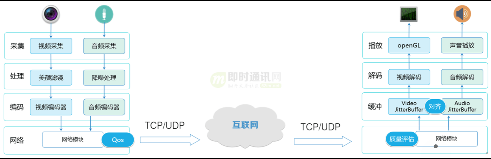

视频、流媒体协议  

## 参考资料 
- [国标文件下载](https://www.biaozhun.org/)

## 视频基础知识
- 1）视频：每秒超过 24 帧的连续画面播放就可以叫视频。
- 2）分辨率：图像的横向和纵向的像素数量，表示图像的精细程度。视频精细程度并不只取决于视频分辨率，还取决于屏幕分辨率。最佳体验为屏幕与视频分辨率相同且全屏播放，视频分辨率过高的话屏幕没有能力去呈现，视频分辨率过低的话无法发挥屏幕的能力。
  - 上采样：当 720P 的视频在 1080P 屏幕上播放时，需要将图像放大，放大操作叫上采样；
  - 下采样：当 1080P 的视频在 720P 屏幕上播放时，需要将图像缩小，缩小操作叫下采样；
- 3）码率：单位时间播放音频或视频的比特数，单位是bps。码率（单位为Mbps）=文件大小（单位为MB）✖️8➗视频时长（单位为秒）。在计算机中，1 Byte=8 bit，1MB=8Mb，大写的 B，代表 Byte（字节）。小写的 b，代表 bit（比特）。动态码率：Variable Bit Rate（VBR）码率随着图像复杂程度的不同而随之变化，内容简单的片段采用较小的码率，内容复杂的片段采用较大的码率，这样既保证了播放质量，又兼顾了数据量的限制；静态比特率：Constant Bit Rate（CBR）码率恒定。
- 4）采样率：每秒从连续信号中提取并组成离散信号的采样个数，单位为赫兹（Hz）。
- 5）帧率：用于测量显示帧数的量度，单位为 FPS。帧率越高，画面越流畅、逼真，对显卡的处理能力要求越高，数据量越大
- 6）视频编码：通过特定的压缩技术，将某个视频格式的文件转换成另一种视频格式。编码的终极目的，就是为了压缩。各种五花八门的视频编码方式，都是为了让视频变得体积更小，有利于存储和传输。
- 7）视频编码格式的标准化：任何技术，都有标准。自从有视频编码以来，就诞生过很多的视频编码标准。编码的两大组织：ISO/IEC（国际标准化组织）、ITU-T（国际电信联盟通信标准部）。
  - ISO/IEC 制定的编码标准：MPEG-x 系列，MPEG-1、MPEG-2、MPEG-4、MPEG-7、MPEG-21 和 MPEG-H等；
  - ITU-T 制定的编码标准：H.26x系列，：H.261、H.262、H.263、H.264 和 H.265 等。
- 8）视频数据的封装（文件格式）：一个视频不光有画面，还有声音，还有字幕。为了把它们统统打包到一起，我们就需要用一个盒子，给它们封装起来。封装，简单来说，就是将已经编码压缩好的视频轨和音频轨按照一定的格式放到一个文件中。所以，文件格式只是一个外壳，本身并不决定视频的画质好坏，最终决定视频质量的，还是要看里面到底装了什么。目前主要的视频容器有如下：MPG、VOB、MP4、3GP、ASF、RMVB、WMV、MOV、Divx、MKV、FLV、TS/PS等。
- 9）视频解码：将视频压缩编码过的数据，解压缩成为视频原始数据，即视频编码的反过程
- 10）直播流程：  
  
- 11）直播流程的关键环节：  
  - 实时音视频采集：通过摄像头和麦克风采集音视频数据，并进行参数设置和同步处理；
  - 音视频编码：将采集到的音视频数据进行编码，以便进行传输。选择合适的编码器和编码格式，如AAC、Opus、H.264、H.265和VP8等；
  - 传输协议：选择合适的传输协议，如RTMP、HLS和WebRTC等，以保证音视频数据的实时传输；
  - 服务器处理：服务器接收、转发和存储音视频数据，进行负载均衡、转码和录制等处理；
  - 音视频解码与播放：将接收到的音视频数据进行解码、渲染和播放，实现音视频同步和延迟优化。

## 一、流媒体概述
流媒体：是指采用流式传输的方式在 在网络中传输音频、视频和多媒体文件的形式  

流式传输方式：是将视频和音频等多媒体文件经过特殊的压缩方式分成一个个压缩包，
由服务器向用户计算机连续、实时传送。用户通过解压设备对这些数据进行解压后，节目就会像发送前那样显示出来。

## 二、几种直播流媒体协议

### RTP :(Real-time Transport Protocol)
- 和 RTP 控制协议 RTCP 一起使用，
- 是建立在 UDP 协议上的.
- RTP 不像http和ftp可完整的下载整个影视文件，它是以固定的数据率在网络上发送数据，客户端也是按照这种速度观看影视文件，当影视画面播放过后，就不可以再重复播放，除非重新向服务器端要求数据。

### RTCP:Real-time Transport Control Protocol 或 RTP Control Protocol或简写 RTCP)
- 实时传输控制协议,是实时传输协议(RTP)的一个姐妹协议
- RTP 协议和 RTP控制协议(RTCP) 一起使用，而且它是建立在UDP协议上的

### RTSP:(Real Time Streaming Protocol)
- RTSP协议是共有协议，并有专门机构做维护。
- RTSP协议一般传输的是 ts、mp4 格式的流。
- RTSP传输一般需要 2-3 个通道，命令和数据通道分离。
- RTSP 是一种双向实时数据传输协议，它允许客户端向服务器端发送请求，如回放、快进、倒退等操作

### RTMP(Real Time Messaging Protocol)
- RTMP协议是 Adobe 的私有协议，未完全公开。
- 是一套视频直播协议
- RTMP协议一般传输的是 flv，f4v 格式流。
- RTMP一般在 TCP 1个通道上传输命令和数据。
- RTMP 基于 flash 无法在 iOS 的浏览器里播放，但是实时性比 HLS 要好

### HLS:HTTP Live Streaming(HLS)
- 苹果公司(Apple Inc.)实现的基于HTTP的流媒体传输协议
- 可实现流媒体的直播和点播,主要应用在iOS系统
- HLS 点播，基本上就是常见的分段HTTP点播，不同在于，它的分段非常小
- HLS 直播最大的不同在于，直播客户端获取到的，并不是一个完整的数据流。
HLS 协议在服务器端将直播数据流存储为连续的、很短时长的媒体文件(MPEG-TS格式)，而客户端则不断的下载并播放这些小文件，
因为服务器端总是会将最新的直播数据生成新的小文件，这样客户端只要不停的按顺序播放从服务器获取到的文件，就实现了直播
- ***VLS ：是一种流服务器，专门用来解决流的各种问题，它也具有一些 VLC 的特征。 videolan 作为服务器可以输出http，rtp，rtsp的流。

### WebRTC
web端实现流媒体的协议。google刚推出WebRTC的时候巨头们要么冷眼旁观，要么抵触情绪很大。使用RTP协议传输。

原则上，RTSP，RTMP，HTTP 都可以做直播和点播，但一般做 直播用 RTSP和RTMP，做点播用 HTTP

## 三、网络摄像头RTSP视频流WEB端实时播放实现方案
### 1、FFmpeg + nginx 将转 hls 通过 video.js 在支持h5浏览器播放（我实现的）
参见：Nginx+FFmpeg实现rtsp流转hls流，在WEB通过H5 video实现视频播放

不足：hls延迟较rtmp、http-flv大

### 2、FFmpeg + nginx-rtmp-module + h5 video，rtsp转rtmp播放
https://blog.csdn.net/gui66497/article/details/78590190
https://blog.csdn.net/LLittleF/article/details/81111713

注：通过video.js播放rtmp流。需要将代码放到服务器，本地windows电脑无法播放

不足：需要浏览器开启flash

### 3、FFmpeg + nginx-http-flv-module + flv.js，rtsp转rtmp，直接播放flv格式
基于nginx-rtmp-module，通过配置将rtmp转为flv，最后通过flv.js播放。
https://github.com/winshining/nginx-http-flv-module/blob/master/README.CN.md
https://segmentfault.com/a/1190000016043297
https://blog.csdn.net/qq_22633333/article/details/96288603#comments

这种方式是最理想的，我目前找到的方案。当然单指不想花钱买收费方案的。

### 4、WebRTC
https://github.com/lulop-k/kurento-rtsp2webrtc
https://www.jianshu.com/p/1ddfa72de165

### 5、streamedian
https://github.com/Streamedian/html5_rtsp_player
https://streamedian.com/
https://streamedian.com/#demo
https://blog.csdn.net/u011489205/article/details/79327275

### 6、h5stream
https://www.linkingvision.com/
https://github.com/liweilup/h5stream
https://blog.csdn.net/Dnison/article/details/81663137

### 7、liveqing
https://www.liveqing.com

## 四、扩展：相关名词介绍
### DVR：Digital Video Recorder，
即数字视频记录器，通常称为数字硬盘录像机，因为采用硬盘作为存储载体已经是最主流的模式。

DVR最主要的特点是：可以单独工作的监/控/设备，可以在本地监/控、回放及报/警处理，当然，现在的DVR也基本具备网络功能，可以实现网络传输

### NVR：Network Video Recorder,
即网络视/频记录器，或者叫网/络硬盘录/像机，其实还有另一个名字：Hybrid DVR，即混合型DVR，  

实际上，是在DVR的基础上，增加了对视/频服务器/网络/摄像机的接入，即除了自身具备硬盘录像机的功能外，还可以存储一些视频服务器/网络摄像机的视频数据。 

### DVS：Digital Video Server，
即数字视/频服/务器，简称视/频服/务器，其实，视/频服/务器是从视频编/码/器发展而来， 主要用来解决远程监控的问题    

视/频服务器与DVR的最大区别是，视/频服务器必须要在网络上才能有用，无法单独使用，一旦网络失效，视/频服务器就失去作用。  

### IPC即IP-CAMERA，
是集成视频服务器和摄像机的功能为一体的数字视频设备；IP-CAMERA网络摄像机一般有内置Web服务的数字摄像机和录音设备，直接与以太网（有线、无线）相连。
  
用户可通过标准Web浏览器观看和收听网络摄像机传送过来的视频和声音

### SIP（Session initialization Protocol，会话初始协议）
是由IETF（Internet Engineering Task Force，因特网工程任务组）制定的多媒体通信协议。)是一个应用层的信令控制协议。  

用于创建、修改和释放一个或多个参与者的会话。这些会话可以是Internet多媒体会议、IP电话或多媒体分发。会话的参与者可以通过组播（multicast）、网状单播（unicast）或两者的混合体进行通信。

### [GB28181协议：](https://blog.csdn.net/fanyun_01/article/details/120536834)
全称为GB/T28181《安全防范视频监控联网系统信息传输、交换、控制技术要求》，是由公安部科技信息化局提出，由全国安全防范报警系统标准化技术委员会(SAC/TC100)归口，公安部一所等多家单位共同起草的一部国家标准（以下简称28181）。     
GB28181协议在全国平安城市、交通、道路等监控中广泛采用，若想做统一的大监控平台，则支持28181协议接入是必不可少的  

目录：
```
1 范围
2 规范性引用文件
3 术语和定义、缩略语 
4 互联结构
	4.1 SIP监控域互联结构
	4.2 SIP监控域与非SIP监控域互联结构
	4.3 联网系统通信协议结构
5 传输要求
	5.1 网络传输协议要求
	5.2 媒体传输协议要求
	5.3 信息传输延迟时间
	5.4 网络传输带宽
	5.5 网络传输质量
	5.6 视频帧率
6 交换要求
	6.1 统一编码规则
	6.2 媒体压缩编解码
	6.3 媒体存储封装格式
	6.4 SDP定义
	6.5 网络传输协议的转换
	6.6 控制协议的转换
	6.7 媒体传输协议的转换
	6.8 媒体数据格式的转换
	6.9 与其他系统的数据交换
	6.10 信令字符集
7 控制要求
	7.1 注册
	7.2 实时视音频点播
	7.3 设备控制
	7.4 报警事件通知和分发
	7.5 设备信息查询
	7.6 状态信息报送
	7.7 历史视音频文件检索
	7.8历史视音频回放
	7.9 历史视音频文件下载
	7.10 网络校时
	7.11 订阅和通知
	7.12 语音广播和语音对讲
8 传输、交换、控制安全性要求
	8.1 设备身份认证
	8.2 数据加密
	8.3 SIP信令认证
	8.4 数据完整性保护
	8.5 访问控制
9 控制、传输流程和协议接口
	9.1 注册和注销
	9.2 实时视音频点播
	9.3 设备控制
	9.4 报警事件通知和分发
	9.5 网络设备信息查询
	9.6 状态信息报送
	9.7 设备视音频文件检索
	9.8 历史视音频的回放
	9.9 视音频文件下载
	9.10 校时
	9.11 订阅和通知
	9.12 语音广播和语音对讲
```

### GA/T1400协议
中华人民共和国 公共安全行业标准-GA/T1400.3－2017 公安视频图像信息应用系统 标准及说明  
GA/T 1400是于2017年首次发布关于图片、视频片段、文件等属性对象的传输协议  
GA/T 1400《公安视频图像信息应用系统》分成4个部分： 
- 第一部分--通用技术要求； 
- 第二部分--应用平台技术要求； 
- 第三部分--数据库技术要求； 
- 第四部分--接口协议部分

 