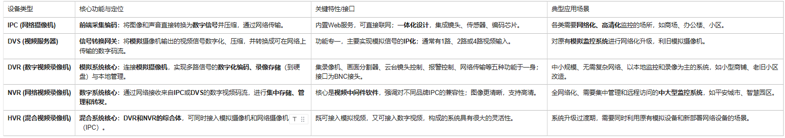
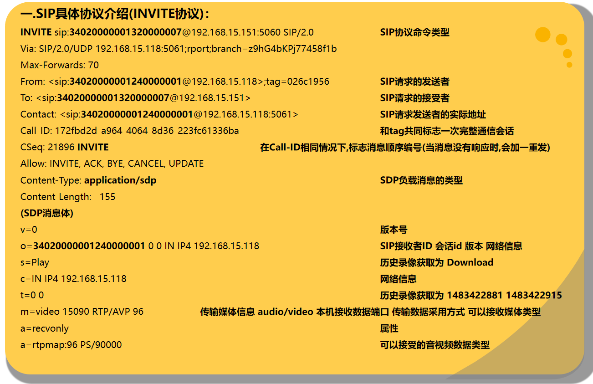
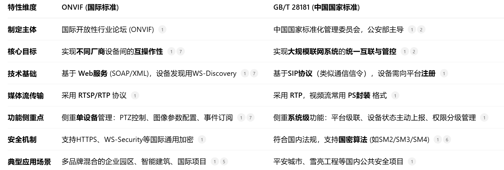
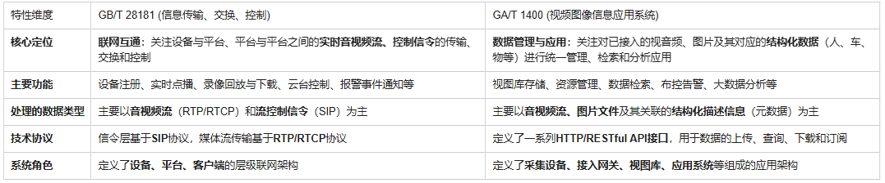

视频、流媒体协议、GBT28181、GAT1400  

## 参考资料 
- [国标文件下载](https://www.biaozhun.org/)

## 视频基础知识
- 1）视频：每秒超过 24 帧的连续画面播放就可以叫视频。
- 2）分辨率：图像的横向和纵向的像素数量，表示图像的精细程度。视频精细程度并不只取决于视频分辨率，还取决于屏幕分辨率。最佳体验为屏幕与视频分辨率相同且全屏播放，视频分辨率过高的话屏幕没有能力去呈现，视频分辨率过低的话无法发挥屏幕的能力。
  - 上采样：当 720P 的视频在 1080P 屏幕上播放时，需要将图像放大，放大操作叫上采样；
  - 下采样：当 1080P 的视频在 720P 屏幕上播放时，需要将图像缩小，缩小操作叫下采样；
- 3）码率：单位时间播放音频或视频的比特数，单位是bps。码率（单位为Mbps）=文件大小（单位为MB）✖️8➗视频时长（单位为秒）。在计算机中，1 Byte=8 bit，1MB=8Mb，大写的 B，代表 Byte（字节）。小写的 b，代表 bit（比特）。动态码率：Variable Bit Rate（VBR）码率随着图像复杂程度的不同而随之变化，内容简单的片段采用较小的码率，内容复杂的片段采用较大的码率，这样既保证了播放质量，又兼顾了数据量的限制；静态比特率：Constant Bit Rate（CBR）码率恒定。
- 4）采样率：每秒从连续信号中提取并组成离散信号的采样个数，单位为赫兹（Hz）。
- 5）帧率：用于测量显示帧数的量度，单位为 FPS。帧率越高，画面越流畅、逼真，对显卡的处理能力要求越高，数据量越大
- 6）视频编码：通过特定的压缩技术，将某个视频格式的文件转换成另一种视频格式。编码的终极目的，就是为了压缩。各种五花八门的视频编码方式，都是为了让视频变得体积更小，有利于存储和传输。
- 7）视频编码格式的标准化：任何技术，都有标准。自从有视频编码以来，就诞生过很多的视频编码标准。编码的两大组织：ISO/IEC（国际标准化组织）、ITU-T（国际电信联盟通信标准部）。
  - ISO/IEC 制定的编码标准：MPEG-x 系列，MPEG-1、MPEG-2、MPEG-4、MPEG-7、MPEG-21 和 MPEG-H等；
  - ITU-T 制定的编码标准：H.26x系列，：H.261、H.262、H.263、H.264 和 H.265 等。
- 8）视频数据的封装（文件格式）：一个视频不光有画面，还有声音，还有字幕。为了把它们统统打包到一起，我们就需要用一个盒子，给它们封装起来。封装，简单来说，就是将已经编码压缩好的视频轨和音频轨按照一定的格式放到一个文件中。所以，文件格式只是一个外壳，本身并不决定视频的画质好坏，最终决定视频质量的，还是要看里面到底装了什么。目前主要的视频容器有如下：MPG、VOB、MP4、3GP、ASF、RMVB、WMV、MOV、Divx、MKV、FLV、TS/PS等。
- 9）视频解码：将视频压缩编码过的数据，解压缩成为视频原始数据，即视频编码的反过程
- 10）直播流程：  
  
- 11）直播流程的关键环节：  
  - 实时音视频采集：通过摄像头和麦克风采集音视频数据，并进行参数设置和同步处理；
  - 音视频编码：将采集到的音视频数据进行编码，以便进行传输。选择合适的编码器和编码格式，如AAC、Opus、H.264、H.265和VP8等；
  - 传输协议：选择合适的传输协议，如RTMP、HLS和WebRTC等，以保证音视频数据的实时传输；
  - 服务器处理：服务器接收、转发和存储音视频数据，进行负载均衡、转码和录制等处理；
  - 音视频解码与播放：将接收到的音视频数据进行解码、渲染和播放，实现音视频同步和延迟优化。

## 一、流媒体概述
流媒体：是指采用流式传输的方式在 在网络中传输音频、视频和多媒体文件的形式  

流式传输方式：是将视频和音频等多媒体文件经过特殊的压缩方式分成一个个压缩包，  
由服务器向用户计算机连续、实时传送。用户通过解压设备对这些数据进行解压后，节目就会像发送前那样显示出来。

## 二、几种流媒体协议

### RTP :(Real-time Transport Protocol)
- 详细说明了在互联网上传递音频和视频的标准数据包格式。它一开始被设计为一个多播协议，但后来被用在很多单播应用中。RTP协议常用于流媒体系统（配合RTSP协议），视频会议和一键通（Push to Talk）系统（配合H.323或SIP），使它成为IP电话产业的技术基础。 
- 是建立在 UDP 协议上的.
- 和 RTP 控制协议 RTCP 一起使用，
- RTP 不像http和ftp可完整的下载整个影视文件，它是以固定的数据率在网络上发送数据，客户端也是按照这种速度观看影视文件，当影视画面播放过后，就不可以再重复播放，除非重新向服务器端要求数据。

### RTCP:Real-time Transport Control Protocol 或 RTP Control Protocol或简写 RTCP)
- 实时传输控制协议,是实时传输协议(RTP)的一个姐妹协议
- RTP 协议和 RTP控制协议(RTCP) 一起使用，而且它是建立在UDP协议上的

### RTSP:(Real Time Streaming Protocol)
- RTSP协议是共有协议，并有专门机构做维护。
- RTSP协议一般传输的是 ts、mp4 格式的流。
- RTSP传输一般需要 2-3 个通道，命令和数据通道分离。
- RTSP 是一种双向实时数据传输协议，它允许客户端向服务器端发送请求，如回放、快进、倒退等操作

### RTMP(Real Time Messaging Protocol)
- RTMP协议是 Adobe 的私有协议，未完全公开。
- 是一套视频直播协议
- RTMP协议一般传输的是 flv，f4v 格式流。
- RTMP一般在 TCP 1个通道上传输命令和数据。
- RTMP 基于 flash 无法在 iOS 的浏览器里播放，但是实时性比 HLS 要好

### HLS:HTTP Live Streaming(HLS)
- 苹果公司(Apple Inc.)实现的基于HTTP的流媒体传输协议
- 可实现流媒体的直播和点播,主要应用在iOS系统
- HLS 点播，基本上就是常见的分段HTTP点播，不同在于，它的分段非常小
- HLS 直播最大的不同在于，直播客户端获取到的，并不是一个完整的数据流。
HLS 协议在服务器端将直播数据流存储为连续的、很短时长的媒体文件(MPEG-TS格式)，而客户端则不断的下载并播放这些小文件，  
因为服务器端总是会将最新的直播数据生成新的小文件，这样客户端只要不停的按顺序播放从服务器获取到的文件，就实现了直播  
- ***VLS ：是一种流服务器，专门用来解决流的各种问题，它也具有一些 VLC 的特征。 videolan 作为服务器可以输出http，rtp，rtsp的流。  

### WebRTC
web端实现流媒体的协议。google刚推出WebRTC的时候巨头们要么冷眼旁观，要么抵触情绪很大。使用RTP协议传输。

原则上，RTSP，RTMP，HTTP 都可以做直播和点播，但一般做 直播用 RTSP和RTMP，做点播用 HTTP

## 三、网络摄像头RTSP视频流WEB端实时播放实现方案
### 1、FFmpeg + nginx 将转 hls 通过 video.js 在支持h5浏览器播放
参见：Nginx+FFmpeg实现rtsp流转hls流，在WEB通过H5 video实现视频播放

不足：hls延迟较rtmp、http-flv大

### 2、FFmpeg + nginx-rtmp-module + h5 video，rtsp转rtmp播放
https://blog.csdn.net/gui66497/article/details/78590190
https://blog.csdn.net/LLittleF/article/details/81111713

注：通过video.js播放rtmp流。需要将代码放到服务器，本地windows电脑无法播放

不足：需要浏览器开启flash

### 3、FFmpeg + nginx-http-flv-module + flv.js，rtsp转rtmp，直接播放flv格式
基于nginx-rtmp-module，通过配置将rtmp转为flv，最后通过flv.js播放。
https://github.com/winshining/nginx-http-flv-module/blob/master/README.CN.md
https://segmentfault.com/a/1190000016043297
https://blog.csdn.net/qq_22633333/article/details/96288603#comments

这种方式是最理想的，目前找到的方案。当然单指不想花钱买收费方案的。

### 4、WebRTC
https://github.com/lulop-k/kurento-rtsp2webrtc
https://www.jianshu.com/p/1ddfa72de165

### 5、streamedian
https://github.com/Streamedian/html5_rtsp_player
https://streamedian.com/
https://streamedian.com/#demo
https://blog.csdn.net/u011489205/article/details/79327275

### 6、h5stream
https://www.linkingvision.com/
https://github.com/liweilup/h5stream
https://blog.csdn.net/Dnison/article/details/81663137

### 7、liveqing
https://www.liveqing.com

## 四、流媒体扩展：相关名词介绍
### H.264与H.265
- H.264与H.265  
  都是视频压缩格式，由于视频本身的码流太大，所以需要经过压缩然后再通过网络进行传输。H.264是目前比较主流的压缩算法，像视频会议设备一般都采用这个编码格式。基础的H.264可以支持在1M带宽下传输720P30帧/秒的图像；H.264 HIGH PROFILE支持在512K带宽下传输720P30帧/秒的图像。
- H.265  
  是比较新的压缩算法，可以更一步提高压缩比，随着我们现在生活中出现的视频格式越来越大（比如现在基本都是1080P甚至4K的显示器，4K片源将来也会越来越多），就需要像H.265这样的新压缩算法，提高效率、节约带宽或存储空间。H.265支持在384K带宽下传输720P30帧/秒。

### DVR：Digital Video Recorder，数字视频记录器
通常称为数字硬盘录像机，因为采用硬盘作为存储载体已经是最主流的模式。

DVR最主要的特点是：可以单独工作的监/控/设备，可以在本地监/控、回放及报/警处理，当然，现在的DVR也基本具备网络功能，可以实现网络传输

### DVS：Digital Video Server，数字视频服务器
简称视频服务器，其实，视频服务器是从视频编码器发展而来， 主要用来解决远程监控的问题    

数字视频服务器DVS与数字视频记录器DVR的最大区别是，视频服务器DVS必须要在网络上才能有用，无法单独使用，一旦网络失效，视频服务器就失去作用。

### NVR：Network Video Recorder, 网络视频记录器
或者叫网络硬盘录像机，其实还有另一个名字：Hybrid DVR，即混合型DVR，

实际上，是在DVR的基础上，增加了对视频服务器网络摄像机的接入，即除了自身具备硬盘录像机的功能外，还可以存储一些视频服务器/网络摄像机的视频数据。

### HVR:（High Definition & Hybrid Digital Video Recorder）高清混合数字硬盘录像机
是同时支持模拟BNC与数字网络RJ45接口的安防监控存储设备

### IPC即IP-CAMERA 
是集成视频服务器和摄像机的功能为一体的数字视频设备；IP-CAMERA网络摄像机一般有内置Web服务的数字摄像机和录音设备，直接与以太网（有线、无线）相连。
  
用户可通过标准Web浏览器观看和收听网络摄像机传送过来的视频和声音

### 设备区别和监控场景选择
- 全新部署且希望实现高清网络监控：优先选择 IPC + NVR 的组合。这是当前的主流方案，能充分发挥高清、网络化的优势。
- 希望对原有的模拟系统进行升级，并保留现有模拟摄像机：可以采用 模拟摄像机 + DVS + NVR 的方案。DVS负责将模拟信号转为数字信号，然后由NVR进行存储管理。
- 小范围、低成本、以本地监控为主的场景：模拟摄像机 + DVR 的方案依然简单实用，成本较低。
- 需要兼顾新旧设备：HVR 是理想选择，它能在不大幅增加系统成本的前提下，灵活地混合接入模拟和网络摄像机，实现无缝过渡。



### SIP（Session initialization Protocol，会话初始协议）
是由IETF（Internet Engineering Task Force，因特网工程任务组）制定的多媒体通信协议。是一个应用层的信令控制协议。  
用于创建、修改和释放一个或多个参与者的会话。这些会话可以是Internet多媒体会议、IP电话或多媒体分发。会话的参与者可以通过组播（multicast）、网状单播（unicast）或两者的混合体进行通信。
- SIP协议使用 RTP协议传送音视频数据流，使用 SDP协议进行媒体描述

``` 
参数/头域                  作用与含义                                   示例或说明
Request-Line     指明SIP方法（如INVITE）和请求目标URI。      INVITE sip:bob@example.com SIP/2.0
Via              记录请求经过的路径，响应将按此路径返回。     包含分支参数branch，用于标识事务。
From/To          标识会话的发起方和接收方。                  包含SIP URI和可选标签tag。
Call-ID          全局唯一标识符，用于关联同一会话的所有消息。  由随机字符串和主机名组成。
CSeq             命令序列号，用于区分和排序同一会话中的请求。  格式为数字 SIP方法，如1 INVITE。
Contact          提供后续请求可直接发送的联系地址。           <sip:alice@192.168.1.100:5060>
Content-Type     指明消息体（Body）的类型。                  值为application/sdp时，表示消息体是SDP数据。
Content-Length   指明消息体的长度（字节数）。                 如Content-Length: 1972。
```



### SDP（Session describe Protocol，会话描述协议）
SDP（会话描述协议）是用于描述实时通信会话（如音视频通话、流媒体传输等）参数的文本型协议。它本身不传输数据，而是像一份详细的“菜单”或“蓝图”，清晰地列出通信双方需要了解的会话所有信息，以便成功建立连接。  
SDP 描述的是一系列参数的集合，它本身不具备协商能力，即不直接决定最终使用哪种编解码格式。真正的协商逻辑是由承载SDP的应用层协议（如SIP）通过特定的模型（如Offer/Answer模型）来完成的。  

SDP 协议的核心在于通过简洁的文本，以 字段=值的键值对形式描述会话。一段标准的 SDP 描述通常包含分为会话级（Session Level）和媒体级（Media Level）描述两个层次的通用信息：
```
会话级参数（Session Level）：对整个会话生效的全局信息。
v=：SDP协议版本号，通常为0。
o=：会话发起者标识，包含用户名、会话ID、版本号、网络类型和地址等信息。
c=：连接信息，指明媒体流发送的基础网络地址。
s=-:会话名称
t=：会话时间，0 0表示会话不受时间限制。

媒体级参数（Media Level）：描述特定媒体流（如音频、视频）的详细信息，以m=行开头。
m=：媒体行，这是媒体描述的核心。它指明了媒体类型（如audio/video）、接收端口、传输协议（如RTP/AVP）以及支持的负载类型（Payload Type） 列表。例如：m=audio 7078 RTP/AVP 96 97。
a=rtpmap：将m=行中的负载类型映射到具体的编解码器。例如：a=rtpmap:96 OPUS/48000/2。
a=fmtp：提供特定编解码器的额外格式参数。例如：a=fmtp:96 useinbandfec=1。
a=sendrecv：表示媒体流的方向，常见值有sendrecv（双向）、recvonly（只接收）等。
a=ice-ufrag/ a=ice-pwd：用于ICE（交互式连接建立）过程的身份验证凭证，对建立P2P连接至关重要。
```

SDP 需要与 SIP、RTSP 等其他协议配合才能工作。以下是其最常见的协作流程：
``` 
- 生成要约：呼叫方（A）生成一份 SDP 描述，列出自己支持的媒体类型（音频、视频）、编解码器、可接收的IP地址和端口等。这份描述称为 Offer。
- 发送要约：A 通过 SIP 协议的 INVITE请求（或其他协议对应方式）将 SDP Offer 发送给被呼叫方（B）。
- 生成应答：B 收到 Offer 后，解析其中的SDP Offer。根据自己的能力从中选择双方都支持的媒体参数，生成一份 SDP Answer，从而完成协商。例如，如果 Offer 中支持编解码器1和2，而B只支持1，则 Answer 中确定使用编解码器1。
- 发送应答：B 通过 SIP 的 200 OK响应将 SDP Answer 返回给 A。
- 建立媒体流：主叫方A收到200 OK后，发送ACK确认。双方根据协商一致的 SDP 参数（如确定的编解码器、IP地址、端口）直接建立媒体连接（通常通过RTP/RTCP协议传输音视频数据），正式开始通信
```

### [PJSIP](https://blog.csdn.net/weixin_31860973/article/details/150430578)
PJSIP是实现SIP协议栈的功能强大、高度可移植的开源多媒体通信库，它实现了SIP、SDP、RTP、STUN、TURN及ICE等协议，支持语音、视频通信、即时消息及NAT穿越功能，被广泛用于构建VoIP电话、视频会议、即时通讯等实时通信应用    
核心组件包括PJSIP、PJMEDIA、PJNATH、PJLIB-UTIL和PJLIB，可运行于Windows、Linux、macOS、iOS及Android等操作系统。‌  

PJSIP的核心功能主要包括以下几个方面：
- SIP消息处理：包括SIP请求和响应消息的发送与接收、请求的路由和转发以及错误消息的生成。
- 事务状态管理：PJSIP维护SIP事务的内部状态，并且对事务的响应进行时序控制。
- 编解码：支持多种音频和视频编解码格式，保证通信双方能够以标准格式交换媒体信息。
- 网络和媒体传输：提供底层的网络功能，包括IPv4/IPv6的网络传输支持以及使用RTP/RTCP协议的媒体传输。
- 安全性：内置加密和认证机制，支持TLS和SRTP，保障通信的私密性和数据的完整性 

### onvif（"Open Network Video Interface Forum 开放式网络视频接口论坛）
ONVIF是国际标准，由行业联盟制定. 在实际系统中ONVIF、GBT28181可以协同工作;一种常见的模式是：在设备接入层使用 ONVIF协议来集成不同品牌的前端摄像机（IPC）和网络录像机（NVR），实现灵活的设备管理；在平台互联层，则通过 GB/T 28181协议将本级平台向上级监控中心（如公安指挥中心）进行级联，满足大规模联网和合规要求  
- ONVIF使用WS-Discovery进行设备发现，基于SOAP/XML实现通信；而GBT28181采用SIP协议注册机制，媒体流采用RTP传输并支持PS封装  
- ONVIF更适合多品牌集成的商业项目，而GBT28181专攻国内公共安全领域的大规模级联系统  

  

### [GB28181协议：](https://blog.csdn.net/fanyun_01/article/details/120536834)
全称为GB/T28181《安全防范视频监控联网系统信息传输、交换、控制技术要求》，是由公安部科技信息化局提出，由全国安全防范报警系统标准化技术委员会(SAC/TC100)归口，公安部一所等多家单位共同起草的一部国家标准（以下简称28181）。       
GB28181协议在全国平安城市、交通、道路等监控中广泛采用，若想做统一的大监控平台，则支持28181协议接入是必不可少的      
- GB28181对联网系统的用户和设备的管理，全部通过一个20位的设备ID号来管理
- GB28181将 SIP定位为联网系统的主要信令基础协议，并利用 SIP协议的有关扩展，实现了对非会话业务的兼顾，例如，对报警业务、历史视音频回放、下载等的支持

目录：
```
1 范围
2 规范性引用文件
3 术语和定义、缩略语 
4 互联结构
	4.1 SIP监控域互联结构
	4.2 SIP监控域与非SIP监控域互联结构
	4.3 联网系统通信协议结构
5 传输要求
	5.1 网络传输协议要求
	5.2 媒体传输协议要求
	5.3 信息传输延迟时间
	5.4 网络传输带宽
	5.5 网络传输质量
	5.6 视频帧率
6 交换要求
	6.1 统一编码规则
	6.2 媒体压缩编解码
	6.3 媒体存储封装格式
	6.4 SDP定义
	6.5 网络传输协议的转换
	6.6 控制协议的转换
	6.7 媒体传输协议的转换
	6.8 媒体数据格式的转换
	6.9 与其他系统的数据交换
	6.10 信令字符集
7 控制要求
	7.1 注册
	7.2 实时视音频点播
	7.3 设备控制
	7.4 报警事件通知和分发
	7.5 设备信息查询
	7.6 状态信息报送
	7.7 历史视音频文件检索
	7.8历史视音频回放
	7.9 历史视音频文件下载
	7.10 网络校时
	7.11 订阅和通知
	7.12 语音广播和语音对讲
8 传输、交换、控制【安全性要求】
	8.1 设备身份认证
	8.2 数据加密
	8.3 SIP信令认证
	8.4 数据完整性保护
	8.5 访问控制
9 控制、传输【流程和协议接口】
	9.1 注册和注销
	9.2 实时视音频点播
	9.3 设备控制
	9.4 报警事件通知和分发
	9.5 网络设备信息查询
	9.6 状态信息报送
	9.7 设备视音频文件检索
	9.8 历史视音频的回放
	9.9 视音频文件下载
	9.10 校时
	9.11 订阅和通知
	9.12 语音广播和语音对讲
```

### GA/T1400协议
中华人民共和国 公共安全行业标准-GA/T1400.3－2017 公安视频图像信息应用系统 标准及说明    
GA/T 1400是于2017年首次发布关于图片、视频片段、文件等属性对象的传输协议    
GA/T 1400《公安视频图像信息应用系统》分成4个部分：   

#### 第一部分--通用技术要求；
``` 
1范围 
2 规范性引用文件
3术语和定义.缩略语
	3.1术语和定义
	3.2缩略语
4 设计原则
	4.1互通性
	4.2 扩展性
	4.3可靠性
	4.4规范性
	4.5安全性
	4.6 易维护性
	4.7易操作性
5系统结构
	5.1系统组成
	5.2级联结构
6 视频图像信息对象
	6.1自动采集的视频图像信息对象
	6.2人工采集的视频图像信息对象
7统一标识编码
	7.1设备与用户统一标识编码规则
	7.2视频图像信息对象统一标识编码规则
	7.3布控与订阅统一标识编码规则
8系统功能
	8.1视频监控基本功能
	8.2采集标注
	8.3存储
	8.4查询与检索
	8.5时空分析
	8.6布控/告警
	8.7订阅与通知
	8.8视频图像分析
	8.9视频案事件管理
	8.10时钟同步
	8.11统计分析 
	8.12用户权限管理
	8.13设备管理
	8.14日志管理
	8.15数据备份 
9系统性能
	9.1视图库
	9.2应用平台
	9.3分析设备/系统
	9.4 时钟同步
10接口协议结构
11安全性
	11.1物理安全
	11.2信息安全
	11.3通信和网络安全
12电磁兼容性
13环境适应性
14电源适应性
15可靠性
16运行与维护
```

#### 第二部分--应用平台技术要求；
``` 
1 范围
2 规范性引用文件
3术语和定义、缩略语
	3.1术语和定义
	3.2缩略语
4 应用平台结构
	4.1应用平台功能组成图
	4.2应用平台外部连接关系
5 功能
	5.1接入
	5.2应用
	5.3管理
6性能 
```

#### 第三部分--数据库技术要求；
``` 
1范围
2 规范性引用文件
3术语、定义和缩略语
	3.1术语和定义
	3.2 缩略语
4公安视频图像信息数据库组成
	4.1公安视频图像信息数据库功能结构
	4.2公安视频图像信息数据库外部连接关系
5视图库存储对象
	5.1视图库存储对象类型
	5.2对象描述方法
	5.3采集设备与采集系统相关对象
	5.4视频图像信息对象
	5.5视频图像分析规则对象
	5.6布控与告警对象
	5.7订阅与通知对象
	5.8联网服务对象
6功能
	6.1 接口
	6.2应用
	6.3管理
7性能
	7.1对象存储时间
	7.2存储对象格式
	7.3并发性能规格
	7.4检索
8 其他
附录A(规范性附录)视图库对象特征属性
附录B(规范性附录)视图库元数据定义
附录C(规范性附录)视图库对象和对象集合XMLSchema描述
附录D(规范性附录)基于 XML的消息体格式
附录E(规范性附录)XML转JSON规范
附录F(规范性附录)查询指令规范
```

#### 第四部分--接口协议部分
``` 
1范围
2规范性引用文件
3术语、定义和缩略语 
	3.1术语和定义
	3.2 缩略语
4 接口分类与协议结构 
	4.1 接口分类
	4.2协议结构 
5 接口功能
	5.1公共功能
	5.2采集接口 
	5.3数据服务接口 
	5.4级联接口 
	5.5分析接口 
6 接口资源描述 
	6.1视图库资源描述 
	6.2分析系统资源描述 
7 接口消息 
	7.1接口消息描述. 
	7.2视图库接口消息. 
	7.3分析系统接口消息 
8消息交互流程 
	8.1创建资源消息交互流程 
	8.2读取资源消息交互流程 
	8.3更新资源消息交互流程 
	8.4删除资源消息交互流程33
9 消息交互安全性 
附录A(规范性附录)REST架构协议模型 
附录B(资料性附录)关键消息交互流程示例 
```

### GB/T 28181 和 GA/T 1400联系
GB/T 28181 和 GA/T 1400 是中国公共安全视频监控领域两个至关重要且功能互补的国家/行业标准。  
GB/T 28181 主要解决视频流的“联网”和“传输”问题，而 GA/T 1400 则侧重于联网后视频图像信息的“管理”和“应用”。  
  

一个典型的工作流程如下：  
``` 
- 1.前端设备接入与联网：各类不同品牌、型号的前端摄像机、录像机（NVR）等，首先通过 GB/T 28181 协议接入到一个区域或单位的视频监控平台中，实现统一的实时视频调看和控制。
- 2.数据汇聚与处理：该平台或专门的接入网关，不仅通过GB/T 28181协议获取视频流，还可能通过其他方式获取图片和视频片段。然后，利用AI算法对这些资源进行智能分析，提取出人、车、物等结构化信息。
- 3.数据上报与应用：平台或网关将视频、图片文件及其对应的结构化描述信息，按照 GA/T 1400 标准定义的接口协议，上传到更上一级的公安视频图像信息应用系统（即视图库）。此后，各类公安实战应用系统（如研判系统、布控系统）则通过GA/T 1400标准接口从视图库中查询、订阅和调用这些数据，实现深度应用。
```